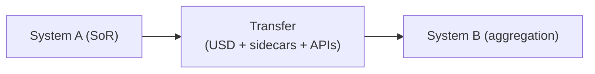

# [Pipeline / Data Transfer Evaluation] — Data A → B

**Version**: 0.0.0 | **Date**: 16.02.2026 | **Time**: 00:31 | **GlobalID**: 20260113_0031_GeneralResearch_Research_3D_ConversionPipeline_E
**Tag block:**
#framework_integration #best_practices #pipeline #validation #conversion #inside_omniverse #outside_omniverse #hybrid #standalone #beads #aas_integration #architecture #omniverse #analysis #case_study #quality_assurance #semantic_governance

**Purpose**: [1 sentence describing the document's purpose]
**Context**: [1 sentence providing context or scope]

> **Status**: [Draft/Final] | **Date**: [DD.MM.YYYY] | **Environment**: [inside_omniverse/outside_omniverse/hybrid/standalone]

> **Author**: [Author Name] | [Website] | [LinkedIn/Contact]

> **Additional Authors**: [Additional contributors]

> **Audience**: [Target audience, e.g., "Technical leads, integration architects, decision makers"]

> **Research Overview**: Evaluate and communicate what a pipeline/connector/adapter can move from **System A → System B** (not only 3D), including IDs, BOM, PMI, DPP/AAS, provenance, and runtime signals when applicable.

---

## Link and Citation Policy (Inherited)

Use `.cursor/rules/documentation-standards.mdc` as the single source of truth for in-text citations (`[[N]](#link-N)`) and `## Links` entry format (`N. [Title](URL) - ...`).
If links are used in this document, add a dedicated `## Links` section and follow the canonical format from that rule file.

---

## 🧾 Copy-paste prompt snippet (for a new agent)

Use this template (pipeline evaluation) as the target structure and return the final document as Markdown.  
For the full generation contract, see **Appendix E — Full Prompt Snippet (Contract)**.  
Return the final document as Markdown.

**Quick Navigation**: [Executive Summary](#executive-summary-1-page) | [Key Conclusions](#key-conclusions) | [Decision Ask](#decision-ask) | [Architecture](#architecture--system-boundaries) | [Implementation](#implementation-plan) | [Evidence](#appendix-a--evidence--references)

---

## Purpose & Audience

- **Purpose**: [1 sentence]
- **Audience**: [roles]
- **Decision this document supports**: [approve PoC / adopt / reject / defer]

---

## Executive Summary (1-page)

[Write 4–7 short paragraphs answering: what is this pipeline, what works today, what doesn’t/assumptions, SoR boundaries, and the recommendation. Keep it narrative (no action list here).]

---

## Key Conclusions

- [3–7 bullets, plain language: what works, what doesn't/assumptions, what we recommend]

---

## Goals & Methodology

### Primary research questions

1. What payload domains are transferred and with what fidelity?
2. What is the system-of-record boundary and roundtrip behavior?
3. What is the minimal PoC to validate fit?

### Approach

[How you investigated and why]

### Tools used (optional)

- Tool: [name vX.Y] — [purpose] — [doc URL] — [how used]

---

## Decision Ask

- **Decision**: [approve PoC / adopt / reject / defer]
- **Timebox**: [e.g., 2–4 weeks]
- **Success criteria**: [3–6 measurable checks]

---

## Architecture & System Boundaries

- **System-of-record boundaries**: [who owns what]
- **Transfer modes**: [export | incremental | live_sync | bidirectional]
- **Roundtrip (definition)**: [what counts as “safe” vs requires PLM/sim APIs]

---

## Design Principles (Decisions & Rationale)

- **Omniverse is aggregation/planning, not SoR**: [why]
- **Layering discipline + stable IDs**: [why]

---

## Data, Semantics, and Ownership Model

Why read this: this is the “how the system fits together” chapter—what data moves, who owns it, and what the pipeline can *not* safely do.

### Payload Inventory

| Data domain | In scope? | Representation | Fidelity (H/M/L) | Loss modes / notes |
|---|---:|---|---|---|
| Geometry | [ ] | [USD Mesh/UsdGeom] | [ ] | |
| Stable IDs | [ ] | [attrs/sidecar] | [ ] | |
| BOM | [ ] | [sidecar/links] | [ ] | |
| PMI | [ ] | [sidecar] | [ ] | |
| DPP fields | [ ] | [mapping] | [ ] | |
| AAS mapping | [ ] | [submodel mapping] | [ ] | |
| Provenance | [ ] | [metadata/logs] | [ ] | |

### Data Contract

- **Identity**: [what ID is stable? where stored?]
- **Namespaces**: [e.g. plm:*, dpp:*, aas:*]
- **Layer ownership**: [source vs consumer vs runtime]

### Transfer Semantics

- **Export style**: [snapshot/delta/stream]
- **Update triggers**: [manual/scheduled/event]
- **Conflict resolution**: [source wins/merge/manual]

---

## Reality Check (what works / what doesn’t / risks)

| Area | Reality today |
|---|---|
| System A → Omniverse | [works as export/publish; validate fidelity] |
| System B (Omniverse) as SoR | [avoid; treat as aggregation/planning] |
| Closed-loop roundtrip | [not turnkey; mapping + governance needed] |
| Semantics (BOM/routing/config) | [stays in PLM/sim; sidecars + APIs] |
| Overlay strategy | [USD layering works if IDs stable] |

Top risks:
- [risk]
- [risk]

---

## Implementation Plan

### Minimal PoC

- Inputs: [sample dataset]
- Steps: [3–7]
- Success criteria: [checkboxes]

---

## Detailed Project Planning (Optional)

> **Note**: The following sections are optional and should be included when the research leads to a software development project or significant implementation effort.

### Project Overview

- **Timeline**: [e.g., 10 weeks total] (classic) / [X hours/days/weeks] (vibe coding)
- **Team**: [roles and allocation]
- **Budget**: [estimate with breakdown]
- **Development Approach**: [Classic / Vibe Coding / Hybrid]
- **Success Criteria**: [measurable outcomes]

### Development Approach & Time Estimation

#### Classic Time Estimation (Traditional Development)
- **Timeline**: [X weeks/months]
- **Team**: [Number and roles]
- **Total Hours**: [Estimated hours]
- **Methodology**: Traditional software development with manual coding, code reviews, and standard testing cycles.

**Breakdown by Phase**:
- Phase 0: [X hours/weeks]
- Phase 1: [X hours/weeks]
- Phase 2: [X hours/weeks]
- Phase 3: [X hours/weeks]
- Phase 4: [X hours/weeks]

#### Vibe Coding Time Estimation (LLM-Assisted Development)
- **Timeline**: [X hours/days/weeks] (typically 3-5x faster than classic)
- **Team**: [Number and roles, typically 1 developer with LLM assistance]
- **Total Hours**: [Estimated hours]
- **Methodology**: LLM-assisted development with strong context engineering, iterative refinement, and continuous validation.

**Breakdown by Phase**:
- Phase 0: [X hours] (Requirements & Context Setup)
- Phase 1: [X hours] (Core Development)
- Phase 2: [X hours] (UI & Integration)
- Phase 3: [X hours] (Testing & Refinement)
- Phase 4: [X hours] (Documentation & Polish)

**Example**: A project estimated at 160-240 classic developer hours might take 40-80 vibe coding hours with proper context engineering.

#### Context Engineering Requirements

**Critical Success Factors**:
- **Strong Requirements**: Well-structured, detailed requirements document (source of truth)
- **Clear Architecture**: Detailed technical architecture and API design before coding
- **Good Planning**: Phased approach with clear deliverables and validation points
- **Context Window Management**: Monitor context usage and summarize at 50-66% capacity

**MCP Server Considerations**:
- ⚠️ **Warning**: MCP servers can consume significant context window space
- Use MCP servers selectively for specific lookups, not as primary context source
- Prefer indexed documentation and project guides over MCP queries when possible
- Monitor context window usage when MCP servers are active

**Context Window Management Strategy**:
- **Monitor Usage**: Track context window utilization throughout development
- **Summarization Threshold**: At 50-66% context window usage, create a summary prompt
- **Handoff Protocol**: When switching agents or sessions, provide:
  - Current state summary
  - Completed work and deliverables
  - Active issues and blockers
  - Next immediate steps
  - Key architectural decisions made
- **Context Preservation**: Maintain critical context (requirements, architecture, decisions) in persistent documentation

**Recommended Workflow**:
1. **Setup Phase**: Establish requirements, architecture, and development environment (classic: 2 weeks, vibe: 1-2 days)
2. **Development Phase**: Iterative development with LLM assistance, regular validation (classic: 6-8 weeks, vibe: 1-2 weeks)
3. **Testing Phase**: Comprehensive testing and refinement (classic: 2 weeks, vibe: 3-5 days)
4. **Documentation Phase**: User documentation and deployment (classic: 1 week, vibe: 1-2 days)

#### Comparison Table

| Aspect | Classic Development | Vibe Coding |
|--------|---------------------|-------------|
| **Initial Setup** | 2 weeks | 1-2 days |
| **Core Development** | 6-8 weeks | 1-2 weeks |
| **Testing & Refinement** | 2 weeks | 3-5 days |
| **Documentation** | 1 week | 1-2 days |
| **Total Timeline** | 10-12 weeks | 2-3 weeks |
| **Speed Factor** | 1x (baseline) | 3-5x faster |
| **Context Requirements** | Standard documentation | Strong context engineering essential |
| **Risk Factors** | Scope creep, technical debt | Context window overflow, MCP interference |

**Key Insight**: Vibe coding accelerates development significantly but requires disciplined context engineering. The time savings come from rapid iteration and LLM assistance, but this requires maintaining high-quality context throughout the process.

### Detailed Phases

#### Phase [N]: [Phase Name] (Week X-Y)

**Objectives**
- [Objective 1]
- [Objective 2]

**Deliverables**
- [ ] [Deliverable 1]
- [ ] [Deliverable 2]

**Tasks & Timeline**
- Day 1-2: [Task description]
- Day 3-4: [Task description]

**Vibe Coding Estimate**: [X hours] (if applicable)  
**Context Engineering Requirements**: [Requirements document, architecture spec, etc.]

**Success Criteria**
- [ ] [Criterion 1]
- [ ] [Criterion 2]

**Risk Mitigation**
- **Risk**: [Risk description]
- **Mitigation**: [Mitigation strategy]

### Resource Requirements

#### Personnel
- **Role** (Weeks X-Y): [hours]
  - [Responsibilities]

#### Infrastructure
- [Infrastructure item]: [Description]

#### Budget Breakdown
- **Category**: [Amount] - [Description]
- **Total**: [Total amount]

### Risk Assessment & Mitigation

| Risk | Probability | Impact | Mitigation Strategy | Contingency Plan |
|------|------------|--------|-------------------|------------------|
| [Risk] | [Low/Medium/High] | [Low/Medium/High] | [Strategy] | [Plan] |

### Success Metrics & KPIs

#### Technical Metrics
- **Metric**: [Target value]
- **Measurement**: [How to measure]

#### User Experience Metrics
- **Metric**: [Target value]

#### Business Metrics
- **Metric**: [Target value]

### Dependencies & Prerequisites

#### Technical Prerequisites
- [Prerequisite 1]
- [Prerequisite 2]

#### Knowledge Prerequisites
- [Knowledge area 1]
- [Knowledge area 2]

#### Organizational Prerequisites
- [Organizational requirement 1]

### Communication Plan

#### Internal Communication
- **Frequency**: [e.g., Daily standups, Weekly reviews]
- **Format**: [e.g., Status updates, Milestone reviews]

#### External Communication
- **Stakeholders**: [Who]
- **Frequency**: [When]
- **Format**: [How]

### Change Management

#### Scope Change Process
1. [Step 1]
2. [Step 2]

#### Quality Gates
- **Gate**: [Description]
- **Criteria**: [What must be met]

### Post-Implementation Plan

#### Maintenance Phase
- **Bug Fixes**: [Response time]
- **Feature Requests**: [Review frequency]
- **Updates**: [Update schedule]

#### Future Development
- **Roadmap Planning**: [Timeline]
- **Enhancement Planning**: [Areas]

#### Knowledge Transfer
- **Documentation**: [What]
- **Training**: [Who, When]

---

## 🔐 Security / Deployment

- Identity: [SSO/tokens]
- Access control: [publish vs consume]
- Deployment: [workstation/on-prem/cloud]

---

## Appendix A — Evidence & References

### Source Registry

| ID | Source (Title+URL) | Type | Version/Date | Relevance | Quality (A/B/C/D) | Notes |
|---|---|---|---|---|---|---|
| S1 | [Title](URL) | [vendor/standards/academic/community/internal] | [date] | [H/M/L] | [A/B/C/D] | |

### Evidence Matrix

| Claim/Finding | Source IDs | Source Quality | Confidence (high/medium/low) | Evidence Notes |
|---|---|---|---|---|
| [claim] | S1 | [A/B/C/D] | [high/medium/low] | |

### External Resources (optional)

- [Resource](URL) — [why it matters]

---

## 🔄 Next Steps

- [ ] [Action]

---

## Appendix — Terminology & Key Concepts

This glossary defines key terms, acronyms, and concepts used throughout this document. Terms are organized by domain for easier navigation.

### [Domain/Category]

**Term**
- **Definition**: [Clear definition]
- **Context**: [How it's used in this document]
- **Related Terms**: [Links to related terms if applicable]

---

## Appendix B — Version History & Raw Notes

### v1.0.0 - [Current Date]
- Template modernization with enhanced header structure, master tag system integration, and updated discovery location references
- Added Purpose, Context, Status, Author, Audience fields
- Added Master Tag System Integration section
- Added Discovery Paper Reference & Template Derivation section
- Updated discovery location from `01_Research_DISCOVERY` to `02_Research_WIP`

### v0.2.0 - 24.12.2025
- Template version update and date synchronization with configuration rules.

### v0.1.0 - 13.12.2025
- Initial template-aligned evaluation.

---

## Appendix C — Tags

**ENVIRONMENT**: [inside_omniverse | outside_omniverse | hybrid | standalone]

integration_pattern | pipeline | data_transfer | connector | adapter | ...

---

## Appendix D — Discovery Content Not Included

> **Purpose**: This appendix captures all aspects from the discovery file that were **not included** in this research document at the time of creation. This prevents information loss during the discovery → research conversion process and allows future expansion or separate research documents.
> 
> **Note**: More details on these topics can be found in the discovery file. **It is recommended to provide a link to the corresponding discovery file** (e.g., `[Discovery File Name](path/to/discovery_file.md)` or `[Discovery File Name](../02_Research_WIP/discovery_file.md)`).

### Source Discovery File

- **Discovery File**: [Link to discovery file] — [Brief description of what the discovery file contains]
  - Example: `[ComfyUI_ComposableBindings_DISCOVERY.md](../02_Research_WIP/ComfyUI_ComposableBindings_DISCOVERY.md)` — Comprehensive discovery document covering ComfyUI ComposableBindings integration patterns

### Content from Discovery Not Yet Implemented

- [ ] [Aspect/topic from discovery file that was not included]
  - [Brief description or reason why it was excluded]
  - [Link to relevant section in discovery file if applicable]

- [ ] [Another aspect/topic from discovery file]
  - [Brief description]
  - [Link to relevant section in discovery file if applicable]

### Notes on Exclusion

- **Reason for exclusion**: [Why this content was not included - e.g., out of scope, requires separate research, low priority, etc.]
- **Future consideration**: [When/if this should be addressed in future research]
- **Related documents**: [Links to other research documents that might cover this content]

### Link Validation Checklist

**CRITICAL**: Verify all links from discovery file are included in this research document.

#### Link Extraction & Verification

**Discovery File Links Found**: [Count] total links
- Documentation/API links: [Count]
- Community/Tutorial links: [Count]
- Other links: [Count]

**Research Document Links Included**: [Count] total links
- In Source Registry: [Count]
- In Additional Resources: [Count]
- Documented as excluded in Notes on Exclusion: [Count]

#### Validation Status

- [ ] All documentation/API links from discovery are in Source Registry
- [ ] All community/tutorial links from discovery are in Additional Resources
- [ ] Any excluded links are documented in "Notes on Exclusion" with justification
- [ ] Link count matches: Discovery links = Research links (or excluded links documented)

**Validation Result**: [✅ PASS / ❌ FAIL - Missing Links: [list]]

**Missing Links** (if any):
- [Link URL] — [Reason for exclusion / Action needed]

---

## ⚠️ Keyword System Status

**Current State**: We can use the Master Tag system (MasterTech system) to provide standardized taxonomy for cross-document discoverability. Master tag system integration is fully available.

**Master Tag System**: `🏗️ Master_Rules (Framework Foundation)/master_tag_system.yml`

**Tag Integration Guidelines**:
- Use master tag system for document tagging (see Appendix C — Tags section)
- Maintain local keyword index in appendix for document-specific terms
- Follow tag usage standards: min 4 tags, sweet spot 12-15, max 25, required categories, case sensitivity

**Local Keyword Management**: Continue using:
- Section-specific keywords for navigation and discoverability
- Document-specific keyword index in appendix
- Manual keyword curation per document based on content

**Cross-Document Discoverability**: Master Tag system provides standardized taxonomy enabling research documents to be discoverable across the entire framework through consistent tagging.

## 🔗 Discovery Paper Reference & Template Derivation

**Source Document**: `🔬 General_Research (Research Library)/070_Proj_RESEARCH/02_Research_WIP/[Discovery_File_Name]_DISCOVERY.md`

**Template Derivation Process**:
- **Base Template**: `MasterResearch_template.md` (master template)
- **Variant Template**: `Research_3D_ConversionPipeline_Evaluation_template.md`
- **Purpose**: Pipeline/connector evaluation variant for data transfer analysis (3D + metadata + DPP/AAS + runtime)

**Sections Structure**:
- Header with metadata (Purpose, Context, Status, Author, Audience)
- Template traceability
- Executive summary
- Key conclusions
- Goals & methodology (pipeline-specific questions)
- Decision ask
- Architecture & system boundaries
- Design principles
- Data, semantics, and ownership model
- Reality check (what works/doesn't work)
- Implementation plan
- Validation plan
- Common pitfalls
- Security & deployment
- Evidence & references
- Appendices (Version History, Tags, Discovery Content Not Included)

**Design Rationale**:
- **Pipeline focus**: Specialized for evaluating data transfer pipelines and connectors
- **System boundaries**: Emphasizes SoR boundaries and roundtrip behavior
- **Payload analysis**: Structured for analyzing multiple payload domains (3D, metadata, DPP/AAS, runtime)
- **Evidence-driven**: Includes source registry and evidence matrix
- **Discovery tracking**: Appendix D prevents information loss during conversion
- **Tag system integration**: Master tag system for cross-document discoverability

**Usage Context**: This template serves as a specialized framework for evaluating data transfer pipelines, connectors, and adapters, with emphasis on system boundaries, payload fidelity, and roundtrip behavior.

### Raw notes (optional)

[Extra notes, raw links]

---

## Appendix E — Full Prompt Snippet (Contract)

Use `Research_Definition/research_configuration_rules.yml` as the ruling contract.  
Use this template (pipeline evaluation) as the target structure.  
Write in a guided flow: **Executive Summary → Key Conclusions → Decision Ask → Architecture/Boundaries → Understanding → Implementation → Evidence**.  
Transform the attached `*_DISCOVERY.md` into this structure, **preserving ALL links** (critical requirement), and filling Source Registry/Evidence Matrix.  
**Link Validation**: After completing the research, extract all URLs/links from the discovery file and verify every single link appears in either:
- Source Registry (Appendix A) for documentation/API references
- Additional Resources section (Appendix A) for community/tutorial links
- Documented in Appendix D if excluded (with justification)
**Important**: Missing links violate framework rules. Complete link validation checklist in Appendix D before finalizing. After completing the research, review the discovery file and add all aspects that were NOT included to **Appendix D — Discovery Content Not Included** to prevent information loss.  
Return the final document as Markdown.

---

## Appendix F — Framework Integration & Traceability

### 🤖 Agent Usage Instructions

**Template**: `Research_3D_ConversionPipeline_Evaluation_template.md` (Specialized pipeline evaluation)
**Audience**: Technical teams, architects, pipeline developers
**Focus**: Data pipeline evaluation, connector assessment, system integration analysis
**Length**: 500-600 lines (specialized technical evaluation)

**Usage Context**: This specialized template evaluates data transfer pipelines, connectors, and adapters, with emphasis on system boundaries, payload fidelity, and roundtrip behavior.

### 📋 Template Traceability

**REQUIRED**: Every research document created from this template MUST include a "Template Traceability" section that clearly states:

- **Template Used**: `Research_3D_ConversionPipeline_Evaluation_template.md`
- **Template Version**: v1.0.0
- **Template Profile**: `connector_pipeline_evaluation`
- **Template Location**: `🔬 General_Research (Research Library)/030_Proj_TEMPLATES/Research_3D_ConversionPipeline_Evaluation_template.md`

This ensures traceability and helps maintain consistency across research documents.

### 🔗 Framework Integration Notes

**Specialized Template**: This template serves as a specialized variant for evaluating data transfer pipelines and connectors. It follows the MasterResearch template structure while providing domain-specific sections for pipeline evaluation.

**Discovery Workflow**: Documents created from this template follow the standard discovery-to-research workflow with link validation and evidence tracking.

---

## Appendix Y — Deviation Log (Required)

If this document is derived from a `*_DISCOVERY.md`:
- Log any changes vs discovery that affect **claims**, **numbers/thresholds**, **links**, or **scope**.
- If no deviations exist, state: “No deviations from discovery document.”

If this document is not derived from discovery/source:
- State: “N/A (not derived from discovery/source).”

| Item | Source | Document | Status (✅/⚠️) | Justification |
|------|--------|----------|----------------|---------------|
| [What changed] | [Source value] | [Doc value] | [✅/⚠️] | [Why] |
