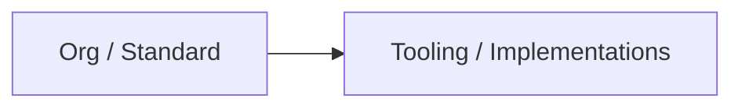

# [Ecosystem Topic] — Holistic Research

**Version**: 0.0.0 | **Date**: 13.01.2026 | **Time**: 00:31 | **GlobalID**: 20260113_0031_GeneralResearch_Research_Holistic_Research_templ

**Purpose**: [1 sentence describing the document's purpose]
**Context**: [1 sentence providing context or scope]

#workflow_optimization #best_practices #case_study

> **Status**: [Draft/Final] | **Date**: [DD.MM.YYYY] | **Environment**: [inside_omniverse/outside_omniverse/hybrid/standalone]

> **Author**: [Author Name] | [Website] | [LinkedIn/Contact]

> **Additional Authors**: [Additional contributors]

> **Audience**: [Target audience, e.g., "Ecosystem researchers, technical leads, decision makers"]

> **Research Overview**: Map an ecosystem (orgs, standards, tooling, governance), with diagrams, comparisons, and evidence.

## 🤖 Agent Note (Discovery → Research workflow)

- **Discovery location**: `research/02_Research_WIP/`
- **Discovery naming**: filenames may contain `_DISCOVERY` **or** `__DISCOVERY` (both accepted)
- **Research naming**: Research filename MUST be derived from discovery filename by replacing `_DISCOVERY` or `__DISCOVERY` with `_RESEARCH` (e.g., `Blender_USD_FAKE_References_DISCOVERY.md` → `Blender_USD_FAKE_References_RESEARCH.md`)
- **Promotion script**: `scripts/generate_research_from_discovery.py` generates a `_RESEARCH` placeholder into `research/02_Research_WIP/`
- **Research structure rules (ruling contract)**: `Research_Definition/research_configuration_rules.yml`

## 📝 Template User Note (variant)

- **Ruling contract**: `Research_Definition/research_configuration_rules.yml`
- **This is a research variant** (YAML profile: `holistic_ecosystem`).
- Use it when the primary deliverable is **maps/diagrams/comparisons + stakeholder framing**.

## 📋 Template Traceability

**REQUIRED**: Every research document created from this template MUST include a "Template Traceability" section (typically in the document metadata or after the Template User Note) that clearly states:

- **Template Used**: `Research_Holistic_Research_template.md`
- **Template Version**: [Version when document was created]
- **Template Profile**: `holistic_ecosystem`
- **Template Location**: `🔬 General_Research (Research Library)/030_Proj_TEMPLATES/Research_Holistic_Research_template.md`

This ensures traceability and helps maintain consistency across research documents.

## 🧾 Copy-paste prompt snippet (for a new agent)

Use `Research_Definition/research_configuration_rules.yml` as the ruling contract.  
Use this template (holistic ecosystem) as the target structure.  
Write in a guided flow: **Executive Summary → Key Conclusions → Decision Ask → Maps/Comparisons → Evidence**.  
Transform the attached `*_DISCOVERY.md` into diagrams + comparisons, **preserving ALL links** (critical requirement), and complete Source Registry/Evidence Matrix.  
**Link Validation**: After completing the research, extract all URLs/links from the discovery file and verify every single link appears in either:
- Source Registry (Appendix A) for documentation/API references
- Additional Resources section (Appendix A) for community/tutorial links
- Documented in Appendix D if excluded (with justification)
**Important**: Missing links violate framework rules. Complete link validation checklist in Appendix D before finalizing. After completing the research, review the discovery file and add all aspects that were NOT included to **Appendix D — Discovery Content Not Included** to prevent information loss.  
Return the final document as Markdown.

**Quick Navigation**: [Executive Summary](#executive-summary-1-page) | [Key Conclusions](#key-conclusions) | [Decision Ask](#decision-ask) | [Diagrams](#-deep-dive) | [Implementation](#implementation-plan) | [Evidence](#evidence--references)

---

## Purpose & Audience

- **Purpose**: [1 sentence]
- **Audience**: [roles]
- **Decision this document supports**: [adopt standard / pick tool / pilot / defer]

---

## Executive Summary (1-page)

[Write 4–7 short paragraphs: what this ecosystem is, why it matters now, what is converging, what is uncertain, and what to do next. End with 3–6 “Next actions”.]

---

## Key Conclusions

- [3–7 bullets: what works, what doesn't/assumptions, what we recommend]

---

## Decision Ask

- **Decision**: [adopt / pilot / choose option / defer]
- **Timebox**: [e.g., 2–6 weeks]
- **Success criteria**: [3–6 measurable checks]

---

## Problem Framing & Scope

[1–3 short paragraphs: what question we’re answering, what’s in/out of scope, and what “good” looks like for stakeholders.]

---

## Goals & Methodology

### Primary research questions

1. [Question]
2. [Question]
3. [Question]

### Approach

[How you investigated and why]

### Tools used (optional)

- Tool: [name vX.Y] — [purpose] — [doc URL] — [how used]

---

## 🔍 Deep Dive

### Ecosystem / Org map

### Architecture layers

| Layer | Purpose | Examples |
|---|---|---|
| Governance | | |
| Standards | | |
| Tooling | | |
| Operations | | |

### Comparisons

| Option | Strengths | Weaknesses | When to use |
|---|---|---|---|
| A | | | |

---

## Implementation Plan

- Phase 0 — Stakeholder alignment
- Phase 1 — Pilot
- Phase 2 — Rollout

---

## Detailed Project Planning (Optional)

> **Note**: The following sections are optional and should be included when the research leads to a software development project or significant implementation effort.

### Project Overview

- **Timeline**: [e.g., 10 weeks total] (classic) / [X hours/days/weeks] (vibe coding)
- **Team**: [roles and allocation]
- **Budget**: [estimate with breakdown]
- **Development Approach**: [Classic / Vibe Coding / Hybrid]
- **Success Criteria**: [measurable outcomes]

### Development Approach & Time Estimation

#### Classic Time Estimation (Traditional Development)
- **Timeline**: [X weeks/months]
- **Team**: [Number and roles]
- **Total Hours**: [Estimated hours]
- **Methodology**: Traditional software development with manual coding, code reviews, and standard testing cycles.

**Breakdown by Phase**:
- Phase 0: [X hours/weeks]
- Phase 1: [X hours/weeks]
- Phase 2: [X hours/weeks]
- Phase 3: [X hours/weeks]
- Phase 4: [X hours/weeks]

#### Vibe Coding Time Estimation (LLM-Assisted Development)
- **Timeline**: [X hours/days/weeks] (typically 3-5x faster than classic)
- **Team**: [Number and roles, typically 1 developer with LLM assistance]
- **Total Hours**: [Estimated hours]
- **Methodology**: LLM-assisted development with strong context engineering, iterative refinement, and continuous validation.

**Breakdown by Phase**:
- Phase 0: [X hours] (Requirements & Context Setup)
- Phase 1: [X hours] (Core Development)
- Phase 2: [X hours] (UI & Integration)
- Phase 3: [X hours] (Testing & Refinement)
- Phase 4: [X hours] (Documentation & Polish)

**Example**: A project estimated at 160-240 classic developer hours might take 40-80 vibe coding hours with proper context engineering.

#### Context Engineering Requirements

**Critical Success Factors**:
- **Strong Requirements**: Well-structured, detailed requirements document (source of truth)
- **Clear Architecture**: Detailed technical architecture and API design before coding
- **Good Planning**: Phased approach with clear deliverables and validation points
- **Context Window Management**: Monitor context usage and summarize at 50-66% capacity

**MCP Server Considerations**:
- ⚠️ **Warning**: MCP servers can consume significant context window space
- Use MCP servers selectively for specific lookups, not as primary context source
- Prefer indexed documentation and project guides over MCP queries when possible
- Monitor context window usage when MCP servers are active

**Context Window Management Strategy**:
- **Monitor Usage**: Track context window utilization throughout development
- **Summarization Threshold**: At 50-66% context window usage, create a summary prompt
- **Handoff Protocol**: When switching agents or sessions, provide:
  - Current state summary
  - Completed work and deliverables
  - Active issues and blockers
  - Next immediate steps
  - Key architectural decisions made
- **Context Preservation**: Maintain critical context (requirements, architecture, decisions) in persistent documentation

**Recommended Workflow**:
1. **Setup Phase**: Establish requirements, architecture, and development environment (classic: 2 weeks, vibe: 1-2 days)
2. **Development Phase**: Iterative development with LLM assistance, regular validation (classic: 6-8 weeks, vibe: 1-2 weeks)
3. **Testing Phase**: Comprehensive testing and refinement (classic: 2 weeks, vibe: 3-5 days)
4. **Documentation Phase**: User documentation and deployment (classic: 1 week, vibe: 1-2 days)

#### Comparison Table

| Aspect | Classic Development | Vibe Coding |
|--------|---------------------|-------------|
| **Initial Setup** | 2 weeks | 1-2 days |
| **Core Development** | 6-8 weeks | 1-2 weeks |
| **Testing & Refinement** | 2 weeks | 3-5 days |
| **Documentation** | 1 week | 1-2 days |
| **Total Timeline** | 10-12 weeks | 2-3 weeks |
| **Speed Factor** | 1x (baseline) | 3-5x faster |
| **Context Requirements** | Standard documentation | Strong context engineering essential |
| **Risk Factors** | Scope creep, technical debt | Context window overflow, MCP interference |

**Key Insight**: Vibe coding accelerates development significantly but requires disciplined context engineering. The time savings come from rapid iteration and LLM assistance, but this requires maintaining high-quality context throughout the process.

### Detailed Phases

#### Phase [N]: [Phase Name] (Week X-Y)

**Objectives**
- [Objective 1]
- [Objective 2]

**Deliverables**
- [ ] [Deliverable 1]
- [ ] [Deliverable 2]

**Tasks & Timeline**
- Day 1-2: [Task description]
- Day 3-4: [Task description]

**Vibe Coding Estimate**: [X hours] (if applicable)  
**Context Engineering Requirements**: [Requirements document, architecture spec, etc.]

**Success Criteria**
- [ ] [Criterion 1]
- [ ] [Criterion 2]

**Risk Mitigation**
- **Risk**: [Risk description]
- **Mitigation**: [Mitigation strategy]

### Resource Requirements

#### Personnel
- **Role** (Weeks X-Y): [hours]
  - [Responsibilities]

#### Infrastructure
- [Infrastructure item]: [Description]

#### Budget Breakdown
- **Category**: [Amount] - [Description]
- **Total**: [Total amount]

### Risk Assessment & Mitigation

| Risk | Probability | Impact | Mitigation Strategy | Contingency Plan |
|------|------------|--------|-------------------|------------------|
| [Risk] | [Low/Medium/High] | [Low/Medium/High] | [Strategy] | [Plan] |

### Success Metrics & KPIs

#### Technical Metrics
- **Metric**: [Target value]
- **Measurement**: [How to measure]

#### User Experience Metrics
- **Metric**: [Target value]

#### Business Metrics
- **Metric**: [Target value]

### Dependencies & Prerequisites

#### Technical Prerequisites
- [Prerequisite 1]
- [Prerequisite 2]

#### Knowledge Prerequisites
- [Knowledge area 1]
- [Knowledge area 2]

#### Organizational Prerequisites
- [Organizational requirement 1]

### Communication Plan

#### Internal Communication
- **Frequency**: [e.g., Daily standups, Weekly reviews]
- **Format**: [e.g., Status updates, Milestone reviews]

#### External Communication
- **Stakeholders**: [Who]
- **Frequency**: [When]
- **Format**: [How]

### Change Management

#### Scope Change Process
1. [Step 1]
2. [Step 2]

#### Quality Gates
- **Gate**: [Description]
- **Criteria**: [What must be met]

### Post-Implementation Plan

#### Maintenance Phase
- **Bug Fixes**: [Response time]
- **Feature Requests**: [Review frequency]
- **Updates**: [Update schedule]

#### Future Development
- **Roadmap Planning**: [Timeline]
- **Enhancement Planning**: [Areas]

#### Knowledge Transfer
- **Documentation**: [What]
- **Training**: [Who, When]

---

## Common Pitfalls and Solutions

- [pitfall]

---

## Decisions & Rationale

| Decision | Options | Chosen | Why |
|---|---|---|---|
| [decision] | [A,B] | [A] | |

---

## Appendix A — Evidence & References

### Source Registry

| ID | Source (Title+URL) | Type | Version/Date | Relevance | Quality (A/B/C/D) | Notes |
|---|---|---|---|---|---|---|
| S1 | [Title](URL) | [vendor/standards/academic/community/internal] | [date] | [H/M/L] | [A/B/C/D] | |

### Evidence Matrix

| Claim/Finding | Source IDs | Source Quality | Confidence (high/medium/low) | Evidence Notes |
|---|---|---|---|---|
| [claim] | S1 | [A/B/C/D] | [high/medium/low] | |

### External Resources (optional)

- [Resource](URL) — [why it matters]

---

## 🔄 Next Steps

- [ ] [Action]

---

## Appendix — Terminology & Key Concepts

This glossary defines key terms, acronyms, and concepts used throughout this document. Terms are organized by domain for easier navigation.

### [Domain/Category]

**Term**
- **Definition**: [Clear definition]
- **Context**: [How it's used in this document]
- **Related Terms**: [Links to related terms if applicable]

---

## Appendix B — Version History & Raw Notes

### v1.0.0 - [Current Date]
- Template modernization with enhanced header structure, master tag system integration, and updated discovery location references
- Added Status, Author, Audience fields
- Added Master Tag System Integration section
- Added Discovery Paper Reference & Template Derivation section
- Updated discovery location from `01_Research_DISCOVERY` to `02_Research_WIP`

### v0.2.0 - 15.12.2025
- Template version update and date synchronization with configuration rules.

### v0.1.0 - 13.12.2025
- Initial holistic template aligned to YAML contract.

---

## Appendix C — Tags

**ENVIRONMENT**: [inside_omniverse | outside_omniverse | hybrid | standalone]

case_study | integration_pattern | ...

---

## Appendix D — Discovery Content Not Included

> **Purpose**: This appendix captures all aspects from the discovery file that were **not included** in this research document at the time of creation. This prevents information loss during the discovery → research conversion process and allows future expansion or separate research documents.
> 
> **Note**: More details on these topics can be found in the discovery file. **It is recommended to provide a link to the corresponding discovery file** (e.g., `[Discovery File Name](path/to/discovery_file.md)` or `[Discovery File Name](../02_Research_WIP/discovery_file.md)`).

### Source Discovery File

- **Discovery File**: [Link to discovery file] — [Brief description of what the discovery file contains]
  - Example: `[ComfyUI_ComposableBindings_DISCOVERY.md](../02_Research_WIP/ComfyUI_ComposableBindings_DISCOVERY.md)` — Comprehensive discovery document covering ComfyUI ComposableBindings integration patterns

### Content from Discovery Not Yet Implemented

- [ ] [Aspect/topic from discovery file that was not included]
  - [Brief description or reason why it was excluded]
  - [Link to relevant section in discovery file if applicable]

- [ ] [Another aspect/topic from discovery file]
  - [Brief description]
  - [Link to relevant section in discovery file if applicable]

### Notes on Exclusion

- **Reason for exclusion**: [Why this content was not included - e.g., out of scope, requires separate research, low priority, etc.]
- **Future consideration**: [When/if this should be addressed in future research]
- **Related documents**: [Links to other research documents that might cover this content]

### Link Validation Checklist

**CRITICAL**: Verify all links from discovery file are included in this research document.

#### Link Extraction & Verification

**Discovery File Links Found**: [Count] total links
- Documentation/API links: [Count]
- Community/Tutorial links: [Count]
- Other links: [Count]

**Research Document Links Included**: [Count] total links
- In Source Registry: [Count]
- In Additional Resources: [Count]
- Documented as excluded in Notes on Exclusion: [Count]

#### Validation Status

- [ ] All documentation/API links from discovery are in Source Registry
- [ ] All community/tutorial links from discovery are in Additional Resources
- [ ] Any excluded links are documented in "Notes on Exclusion" with justification
- [ ] Link count matches: Discovery links = Research links (or excluded links documented)

**Validation Result**: [✅ PASS / ❌ FAIL - Missing Links: [list]]

**Missing Links** (if any):
- [Link URL] — [Reason for exclusion / Action needed]

---

## ⚠️ Keyword System Status

**Current State**: We can use the Master Tag system (MasterTech system) to provide standardized taxonomy for cross-document discoverability. Master tag system integration is fully available.

**Master Tag System**: `🏗️ Master_Rules (Framework Foundation)/master_tag_system.yml`

**Tag Integration Guidelines**:
- Use master tag system for document tagging (see Appendix C — Tags section)
- Maintain local keyword index in appendix for document-specific terms
- Follow tag usage standards: max 12 tags, required categories, case sensitivity

**Local Keyword Management**: Continue using:
- Section-specific keywords for navigation and discoverability
- Document-specific keyword index in appendix
- Manual keyword curation per document based on content

**Cross-Document Discoverability**: Master Tag system provides standardized taxonomy enabling research documents to be discoverable across the entire framework through consistent tagging.

## 🔗 Discovery Paper Reference & Template Derivation

**Source Document**: `🔬 General_Research (Research Library)/070_Proj_RESEARCH/02_Research_WIP/[Discovery_File_Name]_DISCOVERY.md`

**Template Derivation Process**:
- **Base Template**: `MasterResearch_template.md` (master template)
- **Variant Template**: `Research_Holistic_Research_template.md`
- **Purpose**: Holistic ecosystem mapping variant for comprehensive ecosystem research

**Sections Structure**:
- Header with metadata (Purpose, Context, Status, Author, Audience)
- Template traceability
- Executive summary
- Key conclusions
- Problem framing & scope
- Goals & methodology
- Decision ask
- Diagrams (ecosystem maps)
- Comparison tables
- Deep dive analysis
- Implementation plan
- Common pitfalls
- Decisions & rationale
- Evidence & references
- Appendices (Terminology, Version History, Tags, Discovery Content Not Included)

**Design Rationale**:
- **Ecosystem focus**: Specialized for mapping ecosystems (orgs, standards, tooling, governance)
- **Visual emphasis**: Includes diagrams and comparison tables as primary deliverables
- **Stakeholder framing**: Designed for comprehensive ecosystem understanding
- **Evidence-driven**: Includes source registry and evidence matrix
- **Discovery tracking**: Appendix D prevents information loss during conversion
- **Tag system integration**: Master tag system for cross-document discoverability

**Usage Context**: This template serves as a specialized framework for holistic ecosystem research requiring comprehensive mapping, comparison, and stakeholder analysis across organizations, standards, tooling, and governance structures.

## Appendix (optional)

[Interview prep, extra diagrams, raw notes]
