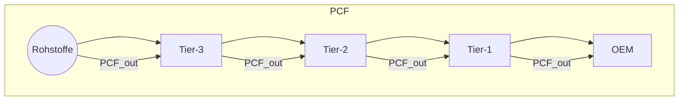
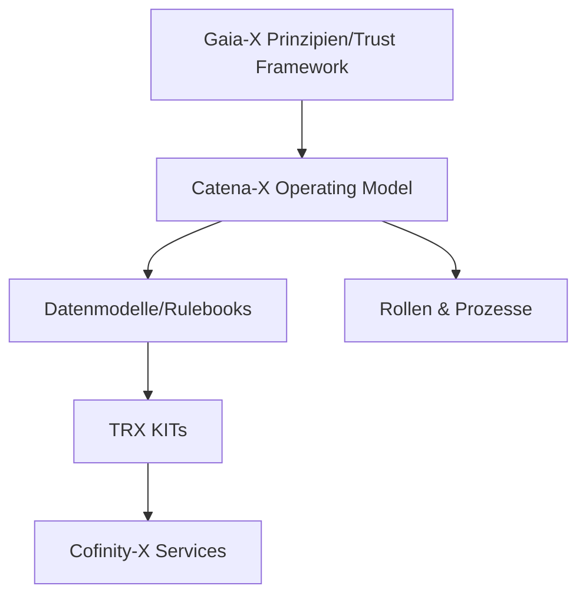
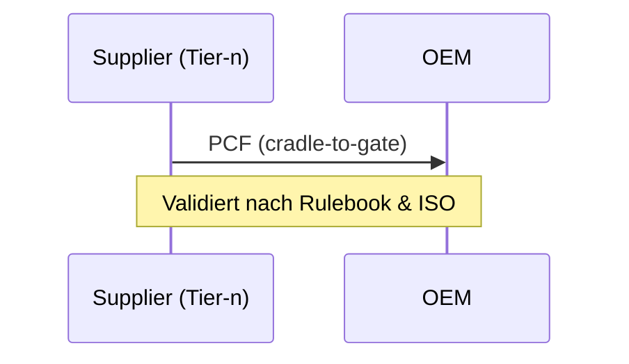
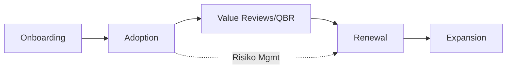
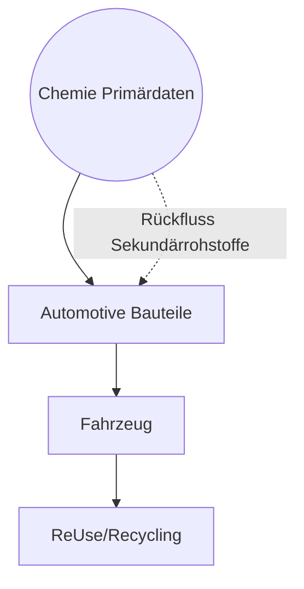

# Holistic Research Template: [Topic]

**Version**: N/A | **Date**: 13.01.2026 | **Time**: 00:20 | **GlobalID**: 20260113_0020_General_Research_AUTO

**Tag block:**
#workflow_optimization #best_practices #case_study #workflow_automation #deterministic_workflows #analysis #framework_integration #quality_assurance

> Purpose-built template to get a fast, deep understanding of complex ecosystems (Catena‑X, DASS‑X, Data Spaces). Combines TL;DR, visuals (Mermaid), comparisons, evidence, and interview prep. Use for internal research, not marketing.

## 🤖 Agent Note (Discovery → Research workflow)

- **Discovery location**: `research/01_Research_DISCOVERY/`
- **Discovery naming**: filenames may contain `_DISCOVERY` **or** `__DISCOVERY` (both accepted)
- **Promotion script**: `scripts/generate_research_from_discovery.py` generates a `_RESEARCH` placeholder into `research/02_Research_WIP/`
- **Research structure rules (source of truth)**: `Research_Definition/research_configuration_rules.yml`

## 📝 Template User Note (YAML contract + templates)

- **Ruling contract**: `Research_Definition/research_configuration_rules.yml`
- **Master research template**: `templates/research_template.md` (YAML profile: `research_master`)
- **This file** is a specialized ecosystem deep-dive (YAML profile: `holistic_ecosystem`) — use it when the primary deliverable is **maps/diagrams/comparisons** and stakeholder framing.

## 📋 Research Overview

**Research Date**: [DD.MM.YYYY]
**Researcher**: [Name]
**Status**: [Draft/Final]
**Priority**: [High/Medium/Low]

## 🧭 TL;DR (60–120 Wörter)

- **Was ist es?** [1–2 Sätze]
- **Warum relevant?** [Business/Regulation/Tech]
- **Kernbausteine**: [Stichworte]
- **Rolle des Zielunternehmens/Produkts**: [Kurz]

## 🎛️ Scope & Leitfragen

1. Was ist [Thema] auf High Level?
2. Wie hängen die Elemente zusammen (Governance → Standardisierung → Zertifizierung → OSS → Betrieb → Nutzung)?
3. Welche Rolle spielt [Unternehmen/Produkt] (z. B. DASS‑X/ConXify)?
4. Welche Risiken/Offene Punkte gibt es?

## 🗺️ Schnellüberblick als Diagramm

### Ecosystem/Org‑Map (Mermaid)
```mermaid
flowchart LR
  CX[Catena-X e.V. (Governance/Rulebooks)] --> STD[Standardisation Framework]
  STD --> CONF[Conformity Assessment (Zertifizierung)]
  STD --> TRX[Eclipse Tractus-X (OSS/KITs)]
  CONF --> OPS[Cofinity-X / Operators]
  TRX --> OPS
  OPS --> ENTERPRISE[Unternehmen / Lieferkette]
  ENTERPRISE <---> DASS[DASS-X]
  DASS --> CONX(ConXify: Multi-Use-Case Suite)
  DASS --> COM2X(COM2X: Onboarding)
  DASS --> ASK2X(ASK2X: AI Agents)
```

### Lieferkette/PCF‑Fluss (Mermaid)


## 🧩 Architektur auf einen Blick

| Ebene | Zweck | Beispiele |
|------|------|-----------|
| Governance | Regeln, Rollen, Rulebooks | Catena‑X e. V., PCF‑Rulebook |
| Standardisierung | Datenmodelle, Vokabulare | CX Standardisation, WBCSD |
| Zertifizierung | Tests, CABs, Zertifikate | Conformity Assessment |
| OSS‑Bausteine | Referenz‑Kits/Connectoren | Eclipse Tractus‑X |
| Betrieb | Marktplatz/Apps | Cofinity‑X, weitere |
| Enablement | Onboarding/Automation | DASS‑X: COM2X/ASK2X |

---

## 🔎 Kernthema 1: Catena‑X & Gaia‑X

### Grundprinzipien
- **Datensouveränität**, **Interoperabilität**, **Standardisierung**, **Sicherheit/Trust**

### Architektur (Mermaid)


### Ziele
- Lieferketten‑Transparenz, Qualität, Nachhaltigkeit/Compliance, Kreislaufwirtschaft

### Key Sources
- [Links]

---

## 🔎 Kernthema 2: Data Spaces / ConXify / IDSA

### Was ist ein Datenraum?
- Föderiertes Ökosystem; Daten bleiben beim Eigentümer; Usage/Access Control; Zertifizierung

### Kernkomponenten (Mermaid)
```mermaid
flowchart LR
  Provider[Data Provider] -- DSP/Policies --> Consumer[Data Consumer]
  Provider <---> ConnectorP[Connector (IDS/DSP)]
  Consumer <---> ConnectorC[Connector (IDS/DSP)]
  Identity[Identity/Trust] --- ConnectorP & ConnectorC
  Broker[Catalog/Broker] -.Metadaten.-> ConnectorC
  Policies[Usage Policies] -.durchsetzen.-> ConnectorP
```

### ConXify im Stack
- Multi‑Use‑Case‑Suite: PCF, Traceability, Certificate Mgmt, Battery Pass
- Ergänzt durch COM2X (Onboarding) und ASK2X (Automation)

---

## 🔎 Kernthema 3: Nachhaltigkeit & PCF

### Kontext
- PCF‑Rulebook (vX), ISO 14067/44, WBCSD Pathfinder, CSRD/ESRS, DPP/Battery Regulation

### PCF Prozess & Datenqualität
- Primärdatenanteil, Chain‑of‑Custody, Auditierbarkeit, Prospective PCF

### Visual (Mermaid)


---

## 🔎 Kernthema 4: Customer Success Management (B2B SaaS)

### KPIs (Tabelle)
| KPI | Definition | Zielsignal |
|-----|------------|-----------|
| Time‑to‑Value | Zeit bis zum 1. validierten Outcome | < [X] Wochen |
| Adoption/Usage | Aktive Nutzer/Unternehmen, Feature‑Adoption | [Trend ↑] |
| NRR | Net Revenue Retention | > 100% |
| Renewal Rate | Verlängerungsquote | > [Y]% |
| Health Score | Zusammengesetzter Score | Green |

### Lifecycle (Mermaid)


### Operating Elements
- Success Plans, QBRs, Champions, Playbooks, Telemetrie/Tracking

---

## 🔎 Kernthema 5: Digitale Wertschöpfungsketten (Automotive & Chemie)

### Warum Datenintegration kritisch ist
- Multi‑Tier‑Komplexität, Compliance‑Druck (CSRD, DPP, Batterie‑VO), Qualität/Rückruf

### Cross‑Industry Brücke
- Chemie liefert Primärdaten (Material/PCF) → Automotive konsolidiert

### Visual (Mermaid)


---

## 🔎 Kernthema 6: Kommunikation & Change Management

### Stakeholder & Botschaften
- Einkauf, ESG/Nachhaltigkeit, Qualität, IT/Security, Legal

### Plays/Checkliste
- Value Hooks, Rollen klären, Enablement‑Programm (Get Informed → Registered → Connected → Identity → Create Value), Quick Wins, Governance Story

### Risiko‑Tabelle
| Risiko | Symptom | Gegenmaßnahme |
|-------|---------|---------------|
| Datenhoheit‑Sorgen | „Wir teilen keine sensiblen Daten“ | Souveränitäts‑/Policy‑Mechanismen erklären |
| Ressourcenmangel | KMU überfordert | Onboarding via COM2X, Templates |

---

## 🧪 Vergleich & Positionierung

### Cofinity‑X vs. DASS‑X/ConXify (Beispielrahmen)
| Aspekt | Cofinity‑X | DASS‑X / ConXify |
|--------|-----------|------------------|
| Rolle | Betrieb/Marktplatz | Enablement/Integration/Automation |
| Fokus | Zertifizierte Services | Multi‑Use‑Case‑Suite + Onboarding |
| Zielgruppe | OEM/Tier‑1 | OEM + KMU + Chemie |

---

## 📚 Source Registry

| ID | Quelle | Typ (Vendor/Non) | Relevanz | Notizen |
|----|--------|------------------|----------|---------|
| S1 | [Link] | Vendor | High | |
| S2 | [Link] | Non‑Vendor | High | |

## 🔗 Evidence Matrix (Behauptung ↔ Quelle)

| Claim | Source IDs | Belegart |
|-------|------------|----------|
| „PCF Austausch ist X‑fach schneller“ | S1,S2 | Slide/Whitepaper |

---

## 🗣️ Interview‑Prep (Optional)

### 60‑Sek‑Pitch (Platzhalter)
> [Eigenen Pitch einfügen]

### Q&A Karten
- Q: „Was ist Catena‑X?“ → A: [Kurzdefinition]
- Q: „DASS‑X Rolle?“ → A: [Enablement/ConXify]

---

## 🛠️ Aufgaben & Nächste Schritte

### Immediate Actions
- [ ] Quellen sichten und Registry füllen
- [ ] Diagramme mit Fakten belegen
- [ ] Vergleichstabelle finalisieren

### Follow‑ups
- [ ] Research → „Final“ setzen
- [ ] Best‑Practice/Worst‑Practice Log aktualisieren

---

## 📝 Anhang

### Glossar
- **PCF**: Product Carbon Footprint
- **DPP**: Digital Product Passport
- **DSP/IDS**: Dataspace Protocol / International Data Spaces

### Mermaid‑Legend (Dark‑friendly)
```mermaid
flowchart LR
  classDef gov fill:#ffd166,stroke:#333,stroke-width:1px,color:#111
  classDef tech fill:#06d6a0,stroke:#333,stroke-width:1px,color:#111
  classDef op fill:#118ab2,stroke:#333,stroke-width:1px,color:#fff
```


