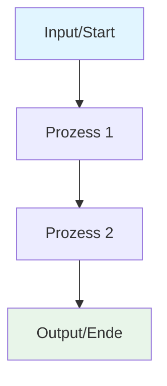
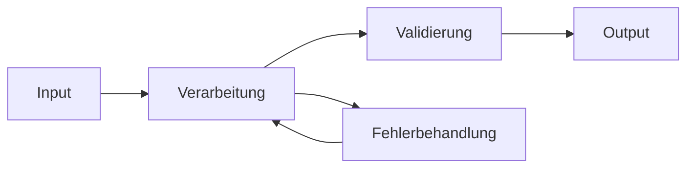
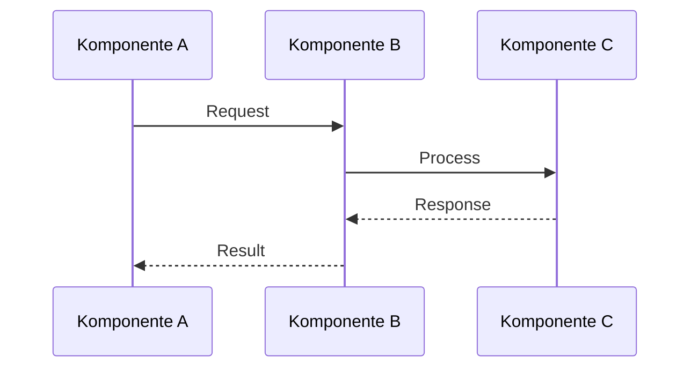
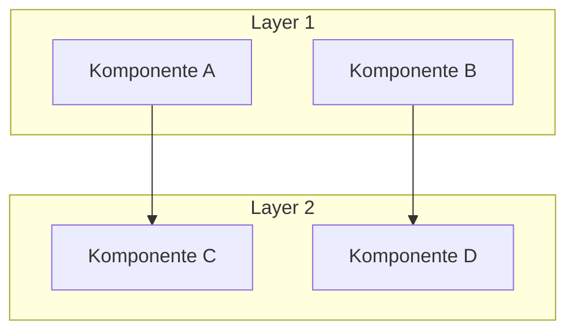
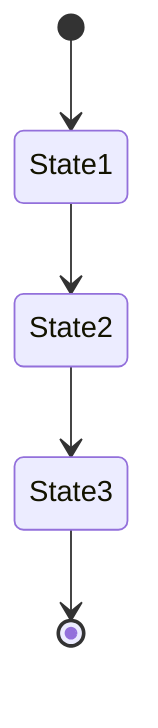
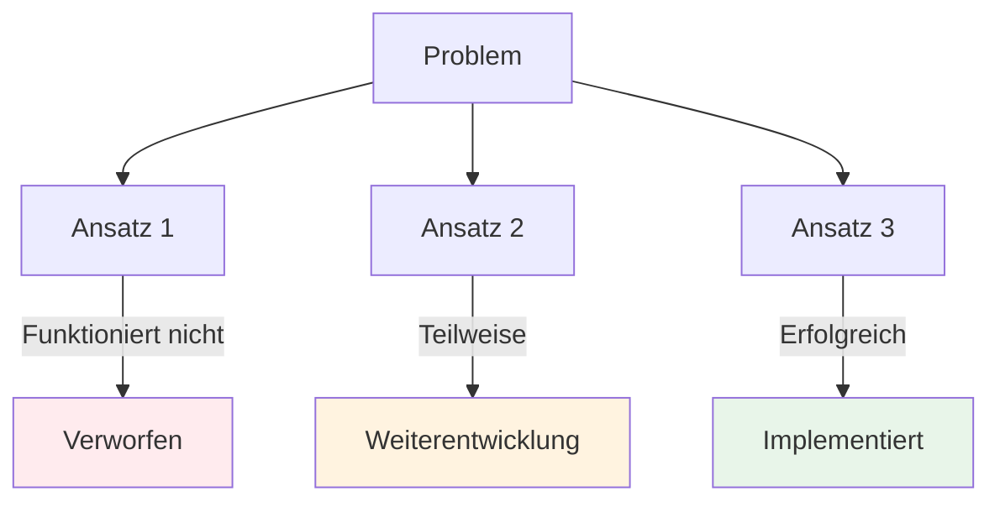
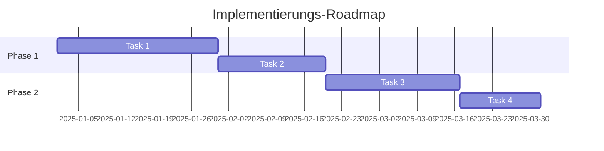

# Was Wir Gemacht Haben: [Projekt/Feature Name]

**Version**: N/A | **Date**: 13.01.2026 | **Time**: 00:20 | **GlobalID**: 20260113_0020_General_Research_AUTO

**Tag block:**
#workflow_optimization #best_practices #case_study #workflow_automation #deterministic_workflows #analysis #framework_integration #performance #optimization

> **Zusammenfassung**: [Kurze technische Beschreibung des Projekts/Features in 1-2 Sätzen]

## 🤖 Agent Note (Discovery → Research workflow)

- **Discovery location**: `research/01_Research_DISCOVERY/`
- **Discovery naming**: filenames may contain `_DISCOVERY` **or** `__DISCOVERY` (both accepted)
- **Promotion script**: `scripts/generate_research_from_discovery.py` generates a `_RESEARCH` placeholder into `research/02_Research_WIP/`
- **Research structure rules (source of truth)**: `Research_Definition/research_configuration_rules.yml`

## 📝 Template User Note (YAML contract + templates)

- **Ruling contract**: `Research_Definition/research_configuration_rules.yml`
- **Master research template**: `templates/research_template.md` (YAML profile: `research_master`)
- **This file** is an implementation log (“what we did”) (YAML profile: `what_we_did`) — use it for postmortems / execution notes, not broad research synthesis.

**Datum**: [Datum der Durchführung]  
**Kontext**: [Technischer Hintergrund - warum dieser Ansatz gewählt wurde]  
**Status**: [In Progress / Completed / On Hold]

---

## Problemstellung & Zielsetzung

### Problembeschreibung

**Ausgangslage**: [Technische Beschreibung des zu lösenden Problems]  
**Herausforderungen**: [Spezifische technische Herausforderungen und Constraints]  
**Zielzustand**: [Gewünschtes technisches Ergebnis oder Verhalten]

### Technische Anforderungen

- **Performance**: [Performance-Anforderungen falls relevant]
- **Kompatibilität**: [Kompatibilitätsanforderungen, Standards, APIs]
- **Skalierbarkeit**: [Skalierungsaspekte falls relevant]
- **Wartbarkeit**: [Code-Qualität, Dokumentation, Erweiterbarkeit]

---

## Implementierungsansatz

### Architektur & Designentscheidungen

[Beschreibung der gewählten Architektur, Design-Patterns, oder technischen Ansätze]

**Technologie-Stack**:
- [Technologie 1]: [Begründung]
- [Technologie 2]: [Begründung]
- [Technologie 3]: [Begründung]

### Systemarchitektur / Workflow Diagramm



*Beschreibung: [Erklärung was das Diagramm zeigt]*

---

## Implementierung

### Phase 1: [Phase Name]

**Ziel**: [Technisches Ziel dieser Phase]

**Implementierung**:
- **Komponente/Funktion**: [Was wurde implementiert]
- **Technischer Ansatz**: [Wie wurde es technisch umgesetzt]
- **Code-Beispiel/Pattern**: [Relevante Code-Snippets oder Konfigurationen]
- **Ergebnis**: [Technisches Ergebnis, Metriken, Verifikation]

**Technische Details**:
```python
# Beispiel Code oder Konfiguration
def example_function():
    pass
```

### Phase 2: [Phase Name]

[Gleiche Struktur wie Phase 1]

### Phase 3: [Phase Name]

[Gleiche Struktur wie Phase 1]

---

## Workflow-Diagramme & Prozessvisualisierung

### Gesamt-Workflow



*Beschreibung: [Erklärung des Gesamt-Workflows]*

### Detaillierter Prozessfluss



*Beschreibung: [Erklärung der Interaktionen zwischen Komponenten]*

### System-Komponenten / Architektur



*Beschreibung: [Erklärung der Systemarchitektur und Komponenten-Beziehungen]*

### Zustandsdiagramm / State Machine



*Beschreibung: [Erklärung der Zustandsübergänge]*

---

## Research & Erkenntnisse

### Technische Erkenntnisse

#### Implementierungsdetails

- **Erkenntnis 1**: [Technische Erkenntnis mit Begründung und Implikationen]
- **Erkenntnis 2**: [Weitere technische Erkenntnisse]
- **Erkenntnis 3**: [Performance-Charakteristika, Limits, Optimierungen]

#### Bewertung Getesteter Ansätze

| Ansatz/Tool | Technische Bewertung | Entscheidung | Begründung |
|------------|---------------------|--------------|------------|
| [Ansatz 1] | [Bewertung] | [Akzeptiert/Verworfen] | [Technische Begründung] |
| [Ansatz 2] | [Bewertung] | [Akzeptiert/Verworfen] | [Technische Begründung] |

### Vergleichsdiagramm: Getestete Ansätze



*Beschreibung: [Erklärung der Evaluierung verschiedener Ansätze]*

### Bekannte Limitierungen & Constraints

- **Limitierung 1**: [Technische Limitierung und Workaround falls vorhanden]
- **Constraint 1**: [Externe Constraints, Dependencies, Versionen]
- **Trade-off 1**: [Technische Trade-offs die gemacht wurden]

---

## Aktueller Implementierungsstand

### Implementierte Komponenten

- [x] **[Komponente 1]**: [Status] - [Technische Beschreibung]
- [x] **[Komponente 2]**: [Status] - [Technische Beschreibung]
- [ ] **[Komponente 3]**: [Status] - [Geplante Implementierung]

### Technische Spezifikationen

**Verwendete Standards/Protokolle**:
- [Standard 1]: [Version/Details]
- [Standard 2]: [Version/Details]

**Dependencies & Versionen**:
- [Dependency 1]: [Version]
- [Dependency 2]: [Version]

**Konfiguration**:
```yaml
# Beispiel Konfiguration
setting1: value1
setting2: value2
```

**Dateipfade & Struktur**:
- **Source Code**: `[pfad]`
- **Konfiguration**: `[pfad]`
- **Dokumentation**: `[pfad]`
- **Tests**: `[pfad]`

---

## Nächste Schritte & Roadmap

### Unmittelbare Implementierungsschritte

1. **[Task 1]**: [Technische Beschreibung des nächsten Implementierungsschritts]
2. **[Task 2]**: [Weitere technische Tasks]
3. **[Task 3]**: [Validierung/Testing Requirements]

### Technische Überlegungen

- **[Thema 1]**: [Technische Optionen und Evaluierung]
- **[Thema 2]**: [Performance-Optimierungen, Skalierung]
- **[Thema 3]**: [Erweiterungen, zukünftige Features]

### Offene Technische Fragen

- **[Frage 1]**: [Technische Frage die noch geklärt werden muss]
- **[Frage 2]**: [Abhängigkeiten, Kompatibilität, Performance]

### Zukünftige Entwicklungen

- **[Feature/Enhancement 1]**: [Technische Beschreibung] - [Warum wertvoll]
- **[Feature/Enhancement 2]**: [Technische Beschreibung] - [Warum wertvoll]

### Roadmap-Diagramm



*Beschreibung: [Zeitplan und Meilensteine]*

---

## Technische Dokumentation

### Code-Beispiele & Snippets

```python
# Beispiel: [Was zeigt dieser Code]
def key_function():
    """
    [Docstring]
    """
    pass
```

### Kommandozeilen-Befehle

```bash
# [Beschreibung was der Befehl macht]
command --option value
```

### API-Verwendung / Integration

```python
# Beispiel API-Integration
from module import Class

instance = Class(param=value)
result = instance.method()
```

---

## Ressourcen & Referenzen

### Dokumentation & Standards

- [Dokumentation 1](https://example.com) - [Technischer Kontext]
- [API Reference](https://example.com/api) - [Was abgedeckt wird]
- [Standard/Spec](https://example.com/spec) - [Relevanter Standard]

### Tools & Bibliotheken

- [Tool/Bibliothek 1](https://example.com) - [Verwendungszweck]
- [Tool/Bibliothek 2](https://example.com) - [Technische Integration]

### Verwandte Projekte & Repositories

- [Projekt/Repo 1](https://github.com/example) - [Technischer Zusammenhang]
- [Projekt/Repo 2](https://github.com/example) - [Verwandte Implementierung]

### Interne Dokumentation

- [Interne Doc 1](./path/to/doc.md) - [Technischer Inhalt]
- [Discovery Document](./path/to/discovery.md) - [Research Hintergrund]

---

## Wichtige Hinweise & Known Issues

### Technische Warnungen

- ⚠️ **[Warning 1]**: [Technische Warnung mit Details]
- ⚠️ **[Warning 2]**: [Kompatibilität, Performance, Breaking Changes]

### Best Practices & Empfehlungen

- 💡 **[Tip 1]**: [Technischer Tip mit Begründung]
- 💡 **[Tip 2]**: [Optimierung, Pattern, Workaround]

### Bekannte Issues & Workarounds

- 📝 **[Issue 1]**: [Beschreibung] - **Workaround**: [Lösung]
- 📝 **[Issue 2]**: [Beschreibung] - **Status**: [In Progress / Resolved]

---

## Link Liste

<!-- Uncomment and fill in as needed -->

<!-- ### Documentation & References
- [Documentation Title](https://example.com/doc) - [Technical context]
- [API Reference](https://example.com/api) - [What it covers]
- [Standard/Specification](https://example.com/spec) - [Relevant standard]

### Tools & Resources
- [Tool Name](https://example.com/tool) - [Technical purpose]
- [Library/Framework](https://example.com/lib) - [Why it's useful]

### Related Projects/Repos
- [Project Name](https://github.com/example/repo) - [Technical relationship]
- [Related Work](https://example.com/work) - [Implementation connection]

### External Links
- [Technical Article](https://example.com/article) - [Key technical takeaway]
- [Forum Discussion](https://example.com/forum) - [Technical topic]

### Internal Links
- [Internal Doc 1](./path/to/doc.md) - [Technical content]
- [Discovery Document](./path/to/discovery.md) - [Research background] -->

---

**Zuletzt aktualisiert**: [Datum]  
**Erstellt von**: [Name]  
**Technischer Review**: [Name/Status]
