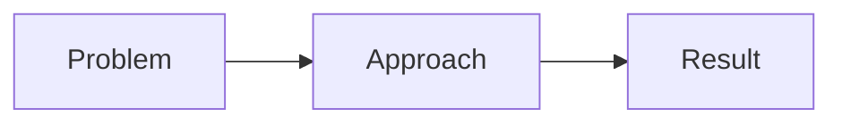
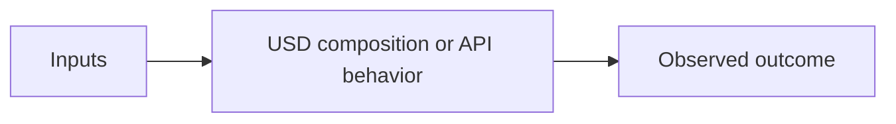

# [Tutorial Title]

**Version**: 0.0.0 | **Date**: 16.02.2026 | **Time**: 00:31 | **GlobalID**: 20260113_0031_GeneralTutorials_MasterTutorial_template
**Tag block:**
#framework_integration #best_practices #conversion #gaming #workflow_automation #deterministic_workflows #analysis #case_study #workflow_optimization #validation #quality_assurance

**Event ID:** EVT-YYYYMMDD-HHMM-[Component]-[SeqNum]  
**Origin Event:** [EVT-ID if evolved from discovery/research/implementation]  
**Related Events:** [List Event IDs showing lifecycle/evolution]  
**Purpose**: [1 sentence describing the tutorial's purpose]  
**Context**: [1 sentence providing context or scope]

#best_practices

---

## 🤖 Agent Note (Discovery → Tutorial workflow)

- **Discovery location**: `Tutorials/0X_Discovery_Files/`
- **Discovery naming**: filenames may contain `_DISCOVERY` **or** `__DISCOVERY` (both accepted)
- **Structure rules (ruling contract)**: `Tutorials_Definition/tutorial_configuration_rules.yml`
- **Template version**: v0.3.0 (includes version field, terminology appendix, version history, anchor IDs)

---

## 📝 Template User Note (master + variants)

- **Master template**: this file (`templates/MasterTutorial_template.md`) is the default shape.
- **Variants**: use a specialized template when the tutorial’s primary deliverable is different.
- **Ruling contract (source of truth)**: `Tutorials_Definition/tutorial_configuration_rules.yml`

## 📚 Template Index (quick picks)

| Category | When to use | Template file |
|---|---|---|
| Master | Default tutorial document | `templates/MasterTutorial_template.md` |
| Foundation | Concept-first learning (analogies, minimal code) | `templates/Tutorial_Foundation_template.md` |
| Integration | Step-by-step implementation + validation | `templates/Tutorial_Integration_template.md` |
| HowTo | Task-first operation guide (shortest safe path + verification) | `templates/Tutorial_HowTo_template.md` |
| Troubleshooting | Debug patterns, scenarios, fix recipes | `templates/Tutorial_Troubleshooting_template.md` |
| Best Practices | Checklists, do/don’t, QA recipes | `templates/Tutorial_BestPractices_template.md` |
| Video Deep-Dive | Transcript + screenshot anchored chapter tutorial from YouTube sessions | `030_Proj_TEMPLATES/Video_Deep_Dive_Tutorials/VIDEO_DEEP_DIVE_TUTORIAL_TEMPLATE.md` (see also `.../VIDEO_DEEP_DIVE_TUTORIAL_PROMPT_PACK.md` and `.../VIDEO_DEEP_DIVE_TUTORIAL_SKILL.md`) |

## 🧾 Copy-paste prompt snippet (for a new agent)

Use the tutorials in this repo as the style reference.
Use this template as the target structure.
Preserve all links.
Keep the tutorial practical: **TLDR → Understanding → Getting Started → Pitfalls/Debug → Best Practices → FAQ → Resources**.
Return the final document as Markdown.

---

## Link and Citation Policy (Inherited)

Follow `.cursor/rules/documentation-standards.mdc` as the single source of truth for in-text citations (`[[N]](#link-N)`) and `## Links` formatting.
Do not redefine the policy in this template; keep link formatting inherited and consistent.

---

## Tags

**Tags:** [Auto-generated based on content]
  - environment: [tag1, tag2]
  - functionality: [tag3, tag4]
  - use_case: [tag5]
  - complexity: [tag6]
  - industry: [tag7]
  - [other relevant categories from master_tag_system.yml]

**Legacy Format (for backward compatibility):**  
[tutorial_type] | [environment] | [topic] | [industry] | [complexity]

---

## Executive Summary

[Write 2–4 short paragraphs in a narrative flow:]

- **What’s going wrong (in practice)**: Describe the friction/failure mode with 1–2 concrete symptoms (e.g., broken variants, unexpected overrides, slow stages, “silent failures”).
- **Why it happens (USD/Omniverse context)**: Name the underlying mechanic at a high level (composition, layer strength ordering, references/payloads, prim typing, etc.) without turning this into the deep dive.
- **What this tutorial changes**: State the approach you’ll teach (a repeatable workflow, a safe pattern, a validation checklist) and who it’s for.
- **Outcome**: What the reader will be able to do by the end (measurable), plus optional credibility (real-world scenario, common toolchain, or typical project context).

**Rule (keep the roles distinct):**
- **Executive Summary** = “Why should I care?” → **no code blocks here**
- **TLDR** = “Show me it working now” → **include a copy/paste snippet + a concrete success signal**

---

## Contents

**Quick Navigation**: [GOAL](#goal) | [TLDR](#-tldr-black-box-quick-start) | [General Overview](#general-overview) | [Getting Started](#getting-started) | [Validation](#validation-checklist) | [Troubleshooting](#troubleshooting--debug-patterns) | [Best Practices](#best-practices) | [FAQ](#faq) | [Terminology](#appendix--terminology--key-concepts) | [Resources](#links)

<aside>
ToC for Notion: Use Notion's native Table of Contents block for full navigation.
</aside>

---

## GOAL

[Single, specific sentence: what the learner will be able to do]

---

## NOTES

| **Prerequisites** | [what you must know before starting] |
| --- | --- |
| **Time Investment** | [e.g., 30–60 minutes] |
| **Special Sources** | [optional: case study / forum / docs used] |
| **Warning** | [scope limits / common gotcha] |

---

## Learning Objectives

> Optional: You can **skip** this list for expert or narrowly scoped tutorials. Keep **GOAL** mandatory.

<aside>

**things you will know**

- [ ] [Outcome 1]
- [ ] [Outcome 2]
- [ ] [Outcome 3]
- [ ] [Outcome 4]

</aside>

---

## 🚀 TLDR: "Black-Box" Quick-Start

<aside>

## The Solution in 60 Seconds

**[Core idea]** = [simple analogy]

**Immediate Benefits:**
- ✅ [benefit]
- ✅ [benefit]
- ✅ [benefit]

**Want to see it in action?**
1. [Step]
2. [Step]
3. [Expected result]

</aside>

```python
# Put a copy-paste starter snippet here.
# If you include USDA, use `python` fencing (tutorials do this often).
# Keep it runnable or clearly labeled as pseudocode.
```

---

**Success signal**: [exact thing the reader should see (UI indicator / expected output / visible behavior)]

---

## Tutorial Metadata

> Governance metadata for maintainers/QA. Keep it concise; readers can ignore it on first pass.

| **Level**           | 🎵 Level X – [Complete Beginner / Intermediate / Advanced] |
|---------------------|-----------------------------------------------------------|
| **Target Audience** | [specific role(s)] |
| **Sources**         | [OpenUSD docs, Omniverse docs, forums, etc.] |
| **Tutorial Status** | [Production-Ready / Draft / In Review] |
| **Version**         | [vX.Y.Z] | [DD.MM.YYYY] |
| **Tested With**     | [KIT x.y.z, USD xx.xx, Isaac Sim x.y if relevant] |
| **Difficulty**      | [Level 1 / 2 / 3] |

---

## General Overview

> Contract: **No jargon without a short explanation**. Keep it approachable and grounded in observable behavior.

- **What problem are we solving?** [short]
- **Why this happens in USD/Omniverse?** [short]
- **What “good” looks like** [short]



---

## A More Detailed Understanding

> Contract: **Jargon is allowed**, but you must introduce a **mental model** and connect it to what users see in tools/code.

### Core Concepts

- [Concept 1]
- [Concept 2]
- [Concept 3]

### Why it works (and when it fails)

- [Explain the mental model]



---

## Common Misconceptions (Optional)

> Use this to prevent FAQ bloat. If you can’t list concrete misconceptions, omit this section.

- “[Misconception]” → Actually: [correction]
- “[Misconception]” → Actually: [correction]

---

## Getting Started

### Step 1 — [Setup]

- [ ] [check]

### Step 2 — [Do the thing]

- [ ] [check]

### Step 3 — [Validate]

- [ ] [check]

```python
# Example: minimal stage / inspection / authoring / validation.
```

---

## Validation Checklist

> How to know this worked (reduce “silent failure”).

- [ ] The expected UI indicator / stage behavior is visible
- [ ] `usdchecker` reports no *new* errors (where relevant)
- [ ] The layer stack/composition arc shows the intended source winning (when relevant)

---

## Industry Adaptation

> Optional: Include only if domain-specific behavior differs meaningfully. If you cannot name a concrete behavioral difference, omit this section.

### Manufacturing / Industrial

- [What changes in this domain]

### AEC

- [What changes in this domain]

### Robotics / Simulation

- [What changes in this domain]

---

## Troubleshooting & Debug Patterns

### UI Debug Warning Recognition

<aside>

- **🟡 Yellow V**: Material binding conflicts → Try V button → If fails → IDE escalation
- **🔵 Blue I**: Variant/inheritance issues → Try I button → If fails → IDE escalation
- **🔴 Red Error**: Critical failures → Skip UI → Direct IDE investigation
- **⚪ No Warning**: Silent failures → Check Layer Stack → If unclear → IDE escalation

</aside>

### Common Symptoms → Likely Causes → Fixes

| Symptom | Likely cause | Fix |
|---|---|---|
| [symptom] | [cause] | [fix] |

### Manual Fix Recipe (template)

```python
# FIXED: [Issue Type] resolved
# Date: DD.MM.YYYY, Fixed by: [Name]
# Issue: [Brief description]
# Solution: [What changed and why]
# Original: [Commented problematic line(s)]
#
# [Corrected snippet]
```

---

## Best Practices

> Put best practices **after** troubleshooting so the recommendations are anchored in real failure modes.

- **Do**: [recommendation]
- **Do**: [recommendation]
- **Avoid**: [pitfall]

---

## FAQ

**Q: [Question]?**  
A: [Answer]

---

## Series Navigation

**Previous**: [Tutorial Title](../Tutorials/[Path]/[File].md)  
**Next**: [Tutorial Title](../Tutorials/[Path]/[File].md)  
**Series Index**: [1000_Learning_Path](../Tutorials/1000_Learning_Path.md)

**Stop here if**: you only needed [X].  
**Continue if**: you want to [Y].

---

## Links

1. <a id="link-1"></a>[OpenUSD Release Documentation](https://openusd.org/release/index.html) - Primary official documentation index for USD concepts and APIs.
2. <a id="link-2"></a>[usdchecker](https://openusd.org/release/api/usdchecker.html) - Validation tool reference for structural and schema checks.
3. <a id="link-3"></a>[Global Glossary](../Tutorials/010_Foundations%20Orientation%20Core%20USD%20Concepts/00_Global_Glossary.md) - Internal term dictionary aligned with this tutorial framework.
4. <a id="link-4"></a>[Global Link List (Annotated)](../Tutorials/00_Global_LinkList_Annotaed.md) - Curated internal reading map for deeper follow-up.

---

<a id="appendix-terminology"></a>
## Appendix — Terminology & Key Concepts

This glossary defines key terms, acronyms, and concepts used throughout this tutorial. Terms are organized by domain for easier navigation.

### [Domain/Category]

**Term**
- **Definition**: [Clear definition]
- **Context**: [How it's used in this tutorial]
- **Related Terms**: [Links to related terms if applicable]

**Example**:
**USD Prim**
- **Definition**: A container for properties, relationships, and composition arcs in USD. Prims form the hierarchical structure of a USD stage.
- **Context**: This tutorial uses prims to organize scene hierarchy and apply transformations
- **Related Terms**: [Stage](#), [Layer](#), [Property](#)

---

## Appendix — Version History

### v1.0.0 - [DD.MM.YYYY]
- Initial tutorial creation
- Tested with [versions]


