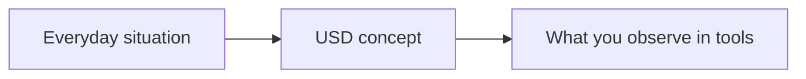

# [Tutorial Title] — Foundation

**Version**: 0.0.0 | **Date**: 16.02.2026 | **Time**: 00:31 | **GlobalID**: 20260113_0031_GeneralTutorials_Tutorial_Foundation_template
**Tag block:**
#framework_integration #best_practices #conversion #gaming #beginner #openusd #usd_core #workflow_automation #deterministic_workflows #analysis #workflow_optimization

**Purpose**: [1 sentence describing the tutorial's purpose]  
**Context**: [1 sentence providing context or scope]

#best_practices

---

## 🤖 Agent Note (Discovery → Tutorial workflow)

- **Discovery location**: `Tutorials/0X_Discovery_Files/`
- **Discovery naming**: filenames may contain `_DISCOVERY` **or** `__DISCOVERY` (both accepted)
- **Structure rules (ruling contract)**: `Tutorials_Definition/tutorial_configuration_rules.yml`
- **Template version**: v0.3.0 (includes version field, terminology appendix, version history, anchor IDs)

---

## Link and Citation Policy (Inherited)

Follow `.cursor/rules/documentation-standards.mdc` as the single source of truth for in-text citations (`[[N]](#link-N)`) and `## Links` formatting.
Do not redefine the policy in this template; keep link formatting inherited and consistent.

---

## Tags

foundation | [environment] | [topic] | [industry] | beginner

---

## Executive Summary

[Write 2–4 short paragraphs in a narrative flow:]

- **What’s confusing (in practice)**: [1–2 concrete symptoms]
- **Why it happens (in USD terms)**: [name the underlying concept plainly]
- **What this tutorial changes**: [the simple mental model + the tiny example you’ll use]
- **Outcome**: [what the reader can explain/do by the end]

**Rule**: Executive Summary contains **no code blocks** (code goes in TLDR).

---

## Contents

**Quick Navigation**: [GOAL](#goal) | [TLDR](#-tldr-black-box-quick-start) | [Tutorial Metadata](#tutorial-metadata) | [General Overview](#general-overview) | [Getting Started](#getting-started) | [Validation](#validation-checklist) | [Best Practices](#best-practices) | [FAQ](#faq) | [Terminology](#appendix--terminology--key-concepts) | [Resources](#links)

<aside>
ToC for Notion: Use Notion's native Table of Contents block for full navigation.
</aside>

---

## GOAL

Explain [concept] in plain language and apply it to a simple USD example.

---

## NOTES

| **Prerequisites** | None / basic 3D familiarity |
| --- | --- |
| **Time Investment** | 10–30 minutes |
| **Special Sources** | [optional] |
| **Warning** | This is concept-first; hands-on depth is limited. |

---

## Learning Objectives

> Optional: You can **skip** this list for expert or narrowly scoped tutorials. Keep **GOAL** mandatory.

<aside>

**things you will know**

- [ ] What [concept] means
- [ ] Why it exists in USD
- [ ] The most common misunderstanding
- [ ] One practical workflow implication

</aside>

---

## 🚀 TLDR: "Black-Box" Quick-Start

<aside>

## The Idea in 60 Seconds

**[Concept]** = [everyday analogy]

**Rule of thumb:**
- ✅ [do]
- ❌ [don’t]

</aside>

---

```python
# Copy/paste mini-example (keep it tiny and heavily explained).
# If you include USDA syntax, use python fencing.
#
# Success should be visible in your target tool (Composer/usdview) after opening the result.
```

**Success signal**: [exact thing the reader should see (visible behavior)]

---

## Tutorial Metadata

> Governance metadata for maintainers/QA. Keep it concise; readers can ignore it on first pass.

| **Level**           | 🎵 Level 1 – Complete Beginner |
|---------------------|--------------------------------|
| **Target Audience** | New USD/Omniverse users, technical champions |
| **Sources**         | OpenUSD docs + examples |
| **Tutorial Status** | Draft |
| **Version**         | [vX.Y.Z] | [DD.MM.YYYY] |
| **Tested With**     | USD xx.xx (if code is included) |
| **Difficulty**      | Level 1 |

---

## General Overview

### The story

- [Narrative explanation]

### The quick table

| Term | Plain meaning | USD example |
|---|---|---|
| [term] | [meaning] | [example] |



---

## A More Detailed Understanding

### For grown-ups (tech translation)

- [Definition]
- [Where it appears]
- [How it interacts with other concepts]

```python
# Optional: tiny “show-me” snippet
# Keep it minimal and heavily explained.
```

---

## Getting Started

### Mini exercise (optional)

- [ ] Open any stage
- [ ] Find [thing]
- [ ] Change [thing]
- [ ] Observe [result]

---

## Validation Checklist

> How to know this worked (reduce “silent failure”).

- [ ] The expected UI indicator / stage behavior is visible
- [ ] No new warnings/errors appeared after the change

---

## Industry Adaptation

- Manufacturing: [angle]
- AEC: [angle]
- Robotics: [angle]

---

## Best Practices

- Use one strong analogy consistently (avoid mixing metaphors).
- Keep the first example tiny and visible in Composer/usdview.

---

## FAQ

**Q: [Common confusion]?**  
A: [Answer]

---

## Series Navigation

**Previous**: [Tutorial Title](../Tutorials/[Path]/[File].md)  
**Next**: [Tutorial Title](../Tutorials/[Path]/[File].md)  
**Series Index**: [1000_Learning_Path](../Tutorials/1000_Learning_Path.md)

---

## Links

1. <a id="link-1"></a>[OpenUSD Glossary](https://openusd.org/release/glossary.html) - Canonical glossary for core USD terms used in beginner explanations.
2. <a id="link-2"></a>[OpenUSD Tutorials](https://openusd.org/release/tut_usd_tutorials.html) - Official hands-on tutorials for extending this foundation lesson.

---

<a id="appendix-terminology"></a>
## Appendix — Terminology & Key Concepts

This glossary defines key terms, acronyms, and concepts used throughout this tutorial. Terms are organized by domain for easier navigation.

### [Domain/Category]

**Term**
- **Definition**: [Clear definition]
- **Context**: [How it's used in this tutorial]
- **Related Terms**: [Links to related terms if applicable]

**Example**:
**USD Prim**
- **Definition**: A container for properties, relationships, and composition arcs in USD. Prims form the hierarchical structure of a USD stage.
- **Context**: This tutorial uses prims to organize scene hierarchy and apply transformations
- **Related Terms**: [Stage](#), [Layer](#), [Property](#)

---

## Appendix — Version History

### v1.0.0 - [DD.MM.YYYY]
- Initial tutorial creation
- Tested with [versions]


