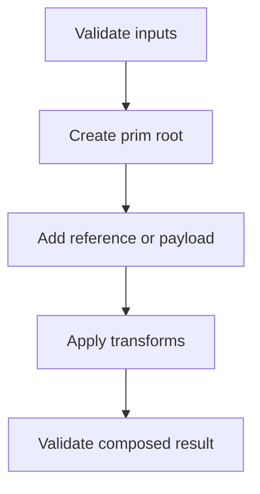

# [Tutorial Title] — Integration

**Version**: 0.0.0 | **Date**: 16.02.2026 | **Time**: 00:31 | **GlobalID**: 20260113_0031_GeneralTutorials_Tutorial_Integration_template
**Tag block:**
#framework_integration #best_practices #aas_integration #conversion #gaming #intermediate #openusd #usd_core #omniverse #workflow_automation #deterministic_workflows #analysis #workflow_optimization #validation #quality_assurance #semantic_governance

**Purpose**: [1 sentence describing the tutorial's purpose]  
**Context**: [1 sentence providing context or scope]

#best_practices

---

## 🤖 Agent Note (Discovery → Tutorial workflow)

- **Discovery location**: `Tutorials/0X_Discovery_Files/`
- **Discovery naming**: filenames may contain `_DISCOVERY` **or** `__DISCOVERY` (both accepted)
- **Structure rules (ruling contract)**: `Tutorials_Definition/tutorial_configuration_rules.yml`
- **Template version**: v0.3.0 (includes version field, terminology appendix, version history, anchor IDs)

---

## Link and Citation Policy (Inherited)

Follow `.cursor/rules/documentation-standards.mdc` as the single source of truth for in-text citations (`[[N]](#link-N)`) and `## Links` formatting.
Do not redefine the policy in this template; keep link formatting inherited and consistent.

---

## Tags

integration | [environment] | [system] | [api] | intermediate

---

## Executive Summary

[Write 2–4 short paragraphs in a narrative flow:]

- **What’s breaking (in practice)**: [symptoms: missing assets, wrong transforms, broken references, silent failures]
- **Why it happens (USD/Omniverse context)**: [composition + reference/payload + xform ops + path resolution]
- **What this tutorial changes**: [repeatable integration workflow + validation checkpoints]
- **Outcome**: [what the reader can implement + how they’ll know it worked]

**Rule**: Executive Summary contains **no code blocks** (code goes in TLDR).

---

## Contents

**Quick Navigation**: [GOAL](#goal) | [TLDR](#-tldr-black-box-quick-start) | [Tutorial Metadata](#tutorial-metadata) | [Getting Started](#getting-started) | [Validation](#validation-checklist) | [Troubleshooting](#troubleshooting--debug-patterns) | [Best Practices](#best-practices) | [FAQ](#faq) | [Terminology](#appendix--terminology--key-concepts) | [Resources](#links)

<aside>
ToC for Notion: Use Notion's native Table of Contents block for full navigation.
</aside>

---

## GOAL

Implement a reliable integration workflow for [system A] + [system B] using USD composition + validation.

---

## NOTES

| **Prerequisites** | USD basics, Python scripting, tool familiarity |
| --- | --- |
| **Time Investment** | 30–60 minutes |
| **Special Sources** | [docs / forum / sample repo] |
| **Warning** | Integration paths and assets must be resolvable (avoid brittle absolute paths). |

---

## Learning Objectives

- [ ] Implement the integration using a repeatable pattern
- [ ] Validate assets/paths before composing
- [ ] Apply transforms correctly at the integration root
- [ ] Troubleshoot common failure modes

---

## 🚀 TLDR: "Black-Box" Quick-Start

<aside>

## The Integration Pattern in 60 Seconds

- Validate inputs
- Author a stable root prim
- Reference/payload the asset
- Apply transforms on the referencing prim
- Validate the composed result

</aside>

---



```python
# Put a copy-paste starter here that mirrors the pattern used in integration tutorials:
# - validate file exists
# - define prim
# - add reference to asset root
# - apply xform ops
# - save stage
```

**Success signal**: [exact thing the reader should see (loaded prims, correct pose/scale, no new errors)]

---

## Tutorial Metadata

> Governance metadata for maintainers/QA. Keep it concise; readers can ignore it on first pass.

| **Level** | 🎵 Level 2 – Intermediate |
| --- | --- |
| **Target Audience** | Pipeline integrators, tool developers |
| **Sources** | OpenUSD docs + system vendor docs |
| **Tutorial Status** | Draft |
| **Version** | [vX.Y.Z] | [DD.MM.YYYY] |
| **Tested With** | [versions] |
| **Difficulty** | Level 2 |

---

## General Overview

- **Why integration is different from “just making a Mesh prim”**
- **Composition-first thinking**: reference/payload vs copy
- **Validation-first thinking**: detect failures early

---

## A More Detailed Understanding (Optional)

- [Explain the integration mental model: root prim owns reference + xform ops]
- [Explain where failures come from: path resolution, stronger opinions, edit targets]

---

## The Problem with Your Current Code (optional)

```python
# ❌ Example of a common mistake pattern.
# Explain what’s wrong and what the correct pattern is.
```

---

## Getting Started

### Step 1 — Basic integration

- [ ] Validate the asset path exists
- [ ] Create a stable root prim under `/World`
- [ ] Add the reference/payload to the asset root

```python
# Minimal working integration.
```

### Step 2 — Integration with transformations

- [ ] Apply transforms on the prim that holds the reference
- [ ] Use explicit xform ops (avoid manual xformOpOrder edits)

```python
# Add translate/rotate/scale at the referencing prim.
```

### Step 3 — Advanced integration (optional)

- physics, constraints, metadata, schema application, etc.

---

## Validation Checklist

> How to know this worked (reduce “silent failure”).

- [ ] The asset is visible and correctly positioned/scaled
- [ ] No broken reference/payload paths
- [ ] `usdchecker` reports no *new* errors (where relevant)

---

## Troubleshooting & Debug Patterns

<aside>

- **🟡 Yellow V**: Material binding conflicts → Try V button → If fails → IDE escalation
- **🔵 Blue I**: Variant/inheritance issues → Try I button → If fails → IDE escalation
- **🔴 Red Error**: Critical failures → Skip UI → Direct IDE investigation
- **⚪ No Warning**: Silent failures → Check Layer Stack → If unclear → IDE escalation

</aside>

### Common integration failure modes

| Symptom | Likely cause | Fix |
|---|---|---|
| Asset file not found | bad path / working dir mismatch | validate path; use stable relative roots |
| Asset loads but transforms don’t apply | transforms applied to wrong prim | apply ops on referencing prim |
| Asset loads but behavior doesn’t work | missing schemas/physics/material bindings | validate applied APIs; inspect composition stack |

### Manual Fix Recipe (template)

```python
# FIXED: [Issue Type] resolved
# Date: DD.MM.YYYY, Fixed by: [Name]
# Issue: [Brief description]
# Solution: [What changed and why]
# Original: [Commented problematic line(s)]
#
# [Corrected snippet]
```

---

## Best Practices

- Validate inputs early and fail loudly.
- Apply transforms at the integration root prim (the one that holds the reference).
- Keep integration code modular (helper functions).

---

## FAQ

**Q: Should I reference the asset root or a sub-prim?**  
A: [Answer + rule of thumb]

---

## Series Navigation (Optional)

**Previous**: [Tutorial Title](../Tutorials/[Path]/[File].md)  
**Next**: [Tutorial Title](../Tutorials/[Path]/[File].md)  
**Series Index**: [1000_Learning_Path](../Tutorials/1000_Learning_Path.md)

**Stop here if**: you only needed [X].  
**Continue if**: you want to [Y].

---

## Links

1. <a id="link-1"></a>[OpenUSD Composition](https://openusd.org/release/composition.html) - Core composition model for references, payloads, and opinion strength.
2. <a id="link-2"></a>[UsdGeom.Xformable API](https://openusd.org/release/api/class_usd_geom_xformable.html) - API reference for transform ops and xform order behavior.

---

<a id="appendix-terminology"></a>
## Appendix — Terminology & Key Concepts

This glossary defines key terms, acronyms, and concepts used throughout this tutorial. Terms are organized by domain for easier navigation.

### [Domain/Category]

**Term**
- **Definition**: [Clear definition]
- **Context**: [How it's used in this tutorial]
- **Related Terms**: [Links to related terms if applicable]

**Example**:
**USD Prim**
- **Definition**: A container for properties, relationships, and composition arcs in USD. Prims form the hierarchical structure of a USD stage.
- **Context**: This tutorial uses prims to organize scene hierarchy and apply transformations
- **Related Terms**: [Stage](#), [Layer](#), [Property](#)

---

## Appendix — Version History

### v1.0.0 - [DD.MM.YYYY]
- Initial tutorial creation
- Tested with [versions]

---

## Appendix — Additional Examples (Optional)

[Raw notes, extra examples, extended troubleshooting]


