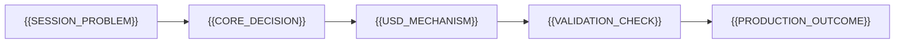

# {{VIDEO_TITLE}} - Video Deep-Dive Tutorial

> Use with execution workflow:
> `VIDEO_DEEP_DIVE_TUTORIAL_SKILL.md`

**Version**: 0.1.0 | **Date**: {{DD.MM.YYYY}} | **Time**: {{HH:MM}} | **GlobalID**: {{YYYYMMDD_HHMM_Repo_Seq}}

**Tag block:**
#openusd #video_deep_dive #digital_twin #best_practices #certification

[]({{COVER_IMAGE_REL_PATH}})

**Canonical Video Source:** [YouTube - {{VIDEO_TITLE}}]({{VIDEO_URL}}) [1 - YouTube video](#link-1)  
**Presenter:** {{PRESENTER}}  
**NVIDIA Session Hosts / Contributors:** {{HOSTS_OR_MODERATORS}}  
**Video Deep-Dive Tutorial** build post factum by [{{AUTHOR_NAME}}]({{AUTHOR_LINKEDIN_URL}})  
**Primary Learning Backbone:** [NVIDIA Learn OpenUSD](https://docs.nvidia.com/learn-openusd/latest/index.html) [2 - Learn OpenUSD curriculum](#link-2)
**Certification Series:** [The Path to OpenUSD Certification - Community Office Hours (YouTube Playlist)]({{SERIES_PLAYLIST_URL}}) [{{SERIES_LINK_NUM}} - Certification series playlist](#link-{{SERIES_LINK_NUM}})

**Most important resources (keep open):**
[19 - Awesome OpenUSD](#link-19), [2 - Learn OpenUSD curriculum](#link-2)

---

## Series Position

This tutorial is part of the OpenUSD certification deep-dive series.

1. [Understanding Composition Arcs](./Understanding%20Composition%20Arcs__VIDEO_DEEP_DIVE_TUTORIAL.md) - {{SERIES_STATUS_1}}
2. [What You Should Know About Content Aggregation](./WhatYouShouldKnowAboutContentAggregation__VIDEO_DEEP_DIVE_TUTORIAL.md) - {{SERIES_STATUS_2}}
3. [Customizing OpenUSD for Your Pipeline](./Customizing_OpenUSD_for_Your_Pipeline__VIDEO_DEEP_DIVE_TUTORIAL.md) - {{SERIES_STATUS_3}}
4. [Building an OpenUSD Pipeline With Data Modeling](./Building%20an%20OpenUSD%20Pipeline%20With%20Data%20Modeling__VIDEO_DEEP_DIVE_TUTORIAL.md) - {{SERIES_STATUS_4}}
5. Session 5 - {{SERIES_STATUS_5}}
6. Session 6 - {{SERIES_STATUS_6}}

---

## The Five-Minute Version

{{FIVE_MINUTE_OVERVIEW_PARAGRAPHS}}

### Mental model map (quick view)



---

## Before You Start (Quick Setup)

You want:

- A working USD + Python environment (`pxr`)
- `usdview` installed for visual inspection
- This deep-dive file open alongside the companion video timestamps

Setup reference:
- [Learn OpenUSD - usdview + Python setup](https://docs.nvidia.com/learn-openusd/latest/usdview-install-instructions.html) [3 - setup](#link-3)
- [Isaac Sim (GitHub)](https://github.com/isaac-sim/IsaacSim)
- [Isaac Lab (GitHub)](https://github.com/isaac-sim/IsaacLab)
- [Omniverse Kit App Template (GitHub, Composer -> Kit App path)](https://github.com/NVIDIA-Omniverse/kit-app-template)

### Optional session-specific prep

- Transcript available (`provided` or `extract`)
- Screenshot folder available

---

## How This Tutorial Works

Two-layer structure:

1. **Story layer** - one narrative thread across all chapters.
2. **Production layer** - practical pipeline behavior, checks, and pitfalls.

### Transcript and capture workflow

- **Transcript mode:** `{{TRANSCRIPT_MODE}}` (`provided` or `extract`)
- **Capture mode:** `{{CAPTURE_MODE}}` (`manual` / `auto` / `hybrid`)
- **Key-moment folder:** `{{KEY_MOMENT_PICS_PATH}}`

Required capture categories:

1. chapter starts
2. code snippets shown
3. exam-style questions
4. answer reveal moments
5. operational pitfalls

---

## Code Companion

Script pack folder:

- `{{SCRIPT_PACK_FOLDER_NAME}}/`

Status rules:

- If scripts exist: link directly.
- If scripts do not exist: mark as **planned / not yet committed**.

---

## Story Spine

Use one stable anchor story (example: `Packaging Cell 3`, `Station 7`) and keep
it continuous across all chapters.

### Story setup

{{STORY_SETUP_PARAGRAPHS}}

### Why this matters for digital twin trust

{{TRUST_PROBLEM_PARAGRAPHS}}

---

## Chapter Outcomes at a Glance

| Chapter | Video section (approx) | Exam topic | Outcome | Learn OpenUSD quick jump |
|---|---|---|---|---|
| [Chapter 0](#chapter-0) | [{{T00}}]({{VIDEO_URL}}&t={{S00}}s) | {{TOPIC_0}} | {{OUTCOME_0}} | [2 - Curriculum](#link-2), [4 - Glossary](#link-4) |
| [Chapter 1](#chapter-1) | [{{T01}}]({{VIDEO_URL}}&t={{S01}}s) | {{TOPIC_1}} | {{OUTCOME_1}} | [5 - {{LINK5_NAME}}](#link-5) |
| [Chapter 2](#chapter-2) | [{{T02}}]({{VIDEO_URL}}&t={{S02}}s) | {{TOPIC_2}} | {{OUTCOME_2}} | [7 - {{LINK7_NAME}}](#link-7) |
| [Chapter 3](#chapter-3) | [{{T03}}]({{VIDEO_URL}}&t={{S03}}s) | {{TOPIC_3}} | {{OUTCOME_3}} | [10 - {{LINK10_NAME}}](#link-10) |
| [Chapter 4](#chapter-4) | [{{T04}}]({{VIDEO_URL}}&t={{S04}}s) | {{TOPIC_4}} | {{OUTCOME_4}} | [11 - {{LINK11_NAME}}](#link-11) |
| [Chapter 5](#chapter-5) | [{{T05}}]({{VIDEO_URL}}&t={{S05}}s) | {{TOPIC_5}} | {{OUTCOME_5}} | [13 - {{LINK13_NAME}}](#link-13) |
| [Chapter 6](#chapter-6) | [{{T06}}]({{VIDEO_URL}}&t={{S06}}s) | {{TOPIC_6}} | {{OUTCOME_6}} | [15 - {{LINK15_NAME}}](#link-15) |
| [Chapter 7](#chapter-7) | [{{T07}}]({{VIDEO_URL}}&t={{S07}}s) | {{TOPIC_7}} | {{OUTCOME_7}} | [17 - {{LINK17_NAME}}](#link-17) |

---

## Key Moments Index

| Timestamp in video | Transcript cue | Why this moment matters |
|---|---|---|
| [{{MM:SS}}]({{VIDEO_URL}}&t={{SXX}}s) | "{{SHORT_CUE}}" | {{MOMENT_REASON}} |

Rules:

- Minimum one key moment per chapter.
- Timestamp links are mandatory (click to jump to the exact video moment).

---

## Operational Validation Checklist

- **Every image with code has a breakout** (audit: list images, check each for code, confirm breakout exists)
- Stage contract (`upAxis`, `metersPerUnit`, `defaultPrim`, timing metadata)
- Composition policy (`sublayer` vs `reference/payload`)
- Render policy (`purpose`, `visibility`, included purposes)
- Overlay policy (`displayColor` vs material expectations)
- Time query policy (`Usd.TimeCode(t)`)

---

<a id="chapter-0"></a>
## Chapter 0 - {{CH0_TITLE}}

**Watch first:** [~{{T00}}]({{VIDEO_URL}}&t={{S00}}s)

### Intro bridge

{{CH0_INTRO_PARAGRAPH}}

{{CH0_TEACHING_CONTENT}}

**Learn OpenUSD ->** [4 - Glossary](#link-4)

---

<a id="chapter-1"></a>
## Chapter 1 - {{CH1_TITLE}}

**Watch first:** [~{{T01}}]({{VIDEO_URL}}&t={{S01}}s)

### Intro bridge

{{CH1_INTRO_PARAGRAPH}}

{{CH1_TEACHING_CONTENT}}

### Script Lab

- `{{CH1_SCRIPT_1}}`
- `{{CH1_SCRIPT_2}}`

---

<a id="chapter-2"></a>
## Chapter 2 - {{CH2_TITLE}}

**Watch first:** [~{{T02}}]({{VIDEO_URL}}&t={{S02}}s)

### Intro bridge

{{CH2_INTRO_PARAGRAPH}}

{{CH2_TEACHING_CONTENT}}

### Script Lab

- `{{CH2_SCRIPT_1}}`

---

<a id="chapter-3"></a>
## Chapter 3 - {{CH3_TITLE}}

**Watch first:** [~{{T03}}]({{VIDEO_URL}}&t={{S03}}s)

### Intro bridge

{{CH3_INTRO_PARAGRAPH}}

{{CH3_TEACHING_CONTENT}}

### Script Lab

- `{{CH3_SCRIPT_1}}`

---

<a id="chapter-4"></a>
## Chapter 4 - {{CH4_TITLE}}

**Watch first:** [~{{T04}}]({{VIDEO_URL}}&t={{S04}}s)

### Intro bridge

{{CH4_INTRO_PARAGRAPH}}

{{CH4_TEACHING_CONTENT}}

### Script Lab

- `{{CH4_SCRIPT_1}}`

---

<a id="chapter-5"></a>
## Chapter 5 - {{CH5_TITLE}}

**Watch first:** [~{{T05}}]({{VIDEO_URL}}&t={{S05}}s)

### Intro bridge

{{CH5_INTRO_PARAGRAPH}}

{{CH5_TEACHING_CONTENT}}

### Script Lab

- `{{CH5_SCRIPT_1}}`

---

<a id="chapter-6"></a>
## Chapter 6 - {{CH6_TITLE}}

**Watch first:** [~{{T06}}]({{VIDEO_URL}}&t={{S06}}s)

### Intro bridge

{{CH6_INTRO_PARAGRAPH}}

{{CH6_TEACHING_CONTENT}}

### Script Lab

- `{{CH6_SCRIPT_1}}`

---

<a id="chapter-7"></a>
## Chapter 7 - {{CH7_TITLE}}

**Watch first:** [~{{T07}}]({{VIDEO_URL}}&t={{S07}}s)

### Intro bridge

{{CH7_INTRO_PARAGRAPH}}

{{CH7_TEACHING_CONTENT}}

### Script Lab

- `{{CH7_SCRIPT_1}}`

---

## If You Remember Only {{X}} Things

1. {{REMEMBER_1}}
2. {{REMEMBER_2}}
3. {{REMEMBER_3}}
4. {{REMEMBER_4}}
5. {{REMEMBER_5}}

---

## Industrial Digital Twin Continuity (Series Crosswalk)

| Scenario | Why this tutorial matters there | Where to continue |
|---|---|---|
| {{SCENARIO_1}} | {{WHY_1}} | {{CONTINUE_1}} |
| {{SCENARIO_2}} | {{WHY_2}} | {{CONTINUE_2}} |
| {{SCENARIO_3}} | {{WHY_3}} | {{CONTINUE_3}} |

---

## Appendix - Debug Playbook ({{TOPIC}})

- Symptom: {{SYMPTOM_1}} -> Likely cause: {{CAUSE_1}} -> Quick check: {{CHECK_1}}
- Symptom: {{SYMPTOM_2}} -> Likely cause: {{CAUSE_2}} -> Quick check: {{CHECK_2}}
- Symptom: {{SYMPTOM_3}} -> Likely cause: {{CAUSE_3}} -> Quick check: {{CHECK_3}}

---

## TEMPLATE-ONLY QA BLOCKS (do not keep in final tutorial docs)

## Breakout Pattern (MANDATORY for every image with code)

**Rule:** Every image that contains code (Python, USDA, or other) MUST have a breakout block immediately after it. Run an audit before declaring the tutorial complete.

For each such screenshot code snippet include:

1. Raw snippet
2. Commented snippet
3. Why it works
4. Why it fails

### Code fence convention (readability rule)

- Use **```py** fences for **both** Python *and* USDA snippets.
- Even when the snippet is USDA, keep the first line `#usda 1.0` so readers immediately recognize the format.

```markdown
> ### Breakout - {{short_name}}
> **Raw snippet:**
> ```py
> {{raw_code}}
> ```
> **Commented walkthrough:**
> ```py
> {{commented_code}}
> ```
> **Why this works**
> - {{works_1}}
> - {{works_2}}
> **Why this fails**
> - {{fails_1}}
> - {{fails_2}}
```

---

## Appendix - Slide Index (Pass 1 + Pass 2 proof)

| Image filename | Slide label | Tutorial anchor | Transcript cue | Status |
|---|---|---|---|---|
| `{{IMG_001}}` | {{LABEL_001}} | `#chapter-{{N}}` | "{{CUE_001}}" | used |

Rule: every image is either used or explicitly marked not used with reason.

---

## Appendix - Status and Scope (Pass 1)

This is the initial deep-dive framework generated before transcript alignment.

- Structure is locked.
- Chapter content is provisional.
- Timestamps and screenshot anchors are refined in Pass 2.

---

## Appendix - Key Pitfalls Checklist

- Unit/axis mismatch
- Composition arc misuse
- Extent vs scale
- Purpose/visibility confusion
- Typed lights vs `LightAPI`
- Material vs `displayColor`
- Primvar interpolation counts
- TimeSamples vs default reads
- Tool behavior vs USD core behavior
- Target-runtime validation

---

## LINKS

<a id="link-1"></a>
1. **YouTube Session** - {{VIDEO_URL}}

<a id="link-2"></a>
2. **Learn OpenUSD Curriculum** - https://docs.nvidia.com/learn-openusd/latest/index.html

<a id="link-3"></a>
3. **usdview + Python Setup** - https://docs.nvidia.com/learn-openusd/latest/usdview-install-instructions.html

<a id="link-4"></a>
4. **Glossary** - https://docs.nvidia.com/learn-openusd/latest/glossary.html

<a id="link-19"></a>
19. **Awesome OpenUSD (curated index)** - https://github.com/matiascodesal/awesome-openusd

---

## Appendix - Full Transcript (Verbatim Paste Zone)

Transcript standard (mandatory):
- This appendix is always the **last section** in the file.
- Keep the transcript in a pre-wrapped block so line breaks are preserved.
- Timestamps (for example `2:25`, `15:43`, `42:58`) must start at the beginning of their own line.
- Keep explicit start/end markers for safe paste and later automation.

<div style="white-space: pre-line;">
===== TRANSCRIPT_START =====
{{PASTE_FULL_TRANSCRIPT_VERBATIM}}
===== TRANSCRIPT_END =====
</div>
